# Authentication & Authorization

---

<div class="r-stack">
  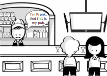
  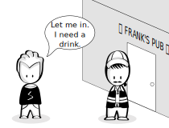
  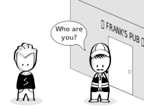
  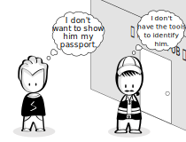
  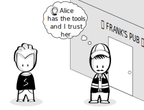
  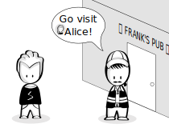
  
  
  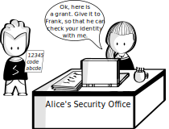
  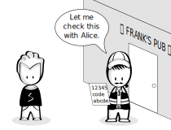
  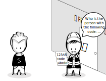
  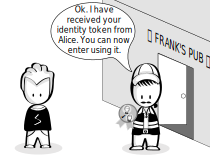
  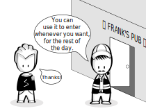
  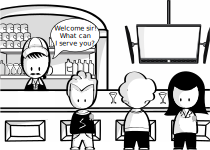
</div>

---

## OpenID Connect Terminology

<style>
.avatar{
  width: 70px;
}

td > img {
  margin: 0 0 0 0 !important;
}
</style>

<table style="font-size: 22pt;">
  <thead>
    <tr>
      <th>OpenID Connect</th>
      <th>Metaphor</th>
      <th>Example</th>
    </tr>
  </thead>
  <tbody>
    <tr>
      <td style="padding-right: 330px;">Resource owner</td>
      <td></td>
      <td><span class="fragment">End user</span></td>
    </tr>
    <tr>
      <td>Client</td>
      <td></td>
      <td><span class="fragment">erp.sap.com</span></td>
    </tr>
    <tr>
      <td>Authorization server</td>
      <td rowspan="2"></td>
      <td rowspan="2"><span class="fragment">SAP IDP</span></td>
    </tr>
    <tr>
      <td>Resource server</td>
    </tr>
    <tr>
      <td>Authorization grant</td>
      <td>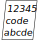</td>
      <td><span class="fragment">Authorization Code</span></td>
    </tr>
    <tr>
      <td>ID Token & Access Token</td>
      <td></td>
      <td><span class="fragment">JWT</span></td>
    </tr>
  </tbody>
</table>

Notes:

- The previous comic was a demonstration of the OpenID Connect flow used for authentication.

---

### [JSON Web Token (JWT)](https://jwt.io/introduction/)

  transfer **claims** securely between two parties

```JavaScript
HEADER {
  "typ": "JWT"           //type of token
  "alg": "RS256"         //signing algorithm
}
PAYLOAD {
  "sub": "1234567890",   //subject, whom the token refers to
  "name": "Dude",        //name, identity information
  "iss": "Alice",        //issuer, who created and signed this token
  "exp": 1516239022,     //expiry date
  ...
}
SIGNATURE [xxx]          //digital signature
```

Notes:
- JWT consists of three segments:
  - header: describes the type of token and the signing algorithm used by the idp
  - payload: represents the claims (set of predefined claims and potentially custom claims set by the idp)
  - signature: used to verify that the message wasn't changed and comes from the idp
- The JWT can be trusted as it is digitally signed by the issuer using a public/private key pair
  - Signature validation: see https://auth0.com/docs/tokens/json-web-tokens/validate-json-web-tokens#check-signature
  - The public key, which is required to verify the token can be acquired from an endpoint on the auth server (e.g. `/auth/certs`).
- in this example some fields are omitted e.g.:
  - "iat": issued at, time at which the token was issued
- JWTs typically have a limited lifetime (expiration) for security reasons:
  - limits amount of time an attacker can use a stolen token
  - information contained in a token could become stale
  - A **refresh token** allows an application to obtain a new access token without prompting the user
- Further reading:
  - [Registered claims](https://tools.ietf.org/html/rfc7519#section-4.1): set of predefined claims, which are recommended, e.g.:
    - `iss` (Issuer), `exp` (Expiration), `sub` (Subject)
  - Can contain more claims, e.g. from [IANA JSON Web Token Registry](https://www.iana.org/assignments/jwt/jwt.xhtml#claims) or "custom" ones

---

## OpenID Connect Flow

<div class="r-stack">
  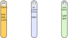
  
  
  
  
  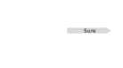
  
  
  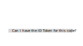
  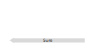
  
</div>

Notes:

- User represents the browser
- Situation: User tried to request a protected resource from client. Client tells user that they need to be logged in
1. User requests the "Log in" page
1. Client redirects to the identity provider. Query parameters include:
  - clientId: which client the user wants to login for
  - scope: list of things the client wants access to on the server. Must contain `openid`
  - redirect-uri: where the server should redirect the user after they logged in.
1. User follows redirect (X stands for the Client)
1. Server asks user to login, using their credentials
1. User logs in.
1. Server redirects client to the `redirect-uri` with a code appended as query parameter
1. User follows redirect.
1. Client requests the corresponding ID Token for the code:
  - The Client authenticates with its client id and client secret.
1. The Server returns the signed ID Token (and possibly a Refresh Token)
1. The Client gives the User a way to access protected resources without having to authenticate again. E.g.:
  - The client gives the token to the user. The user then has to send the token with every request. The client can verify the token to ensure that it was not changed.
  - The Client saves the token and gives the user a session id. The User then has to send the session id with every request. The Client maps the code to the token.

---

### OpenID Connect Client and Server

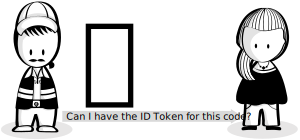

- Client registers on the server with client-id + client secret (password)

Notes:
- A secure communication channel between client and server must be established beforehand.
- The client-id and the client secret are used to securely exchange the authorization code for the ID Token.
- The client must retrieve the public key from the server once, to be able to verify JWTs.

---

## Authentication & Authorization

- Authentication: *who* are you? **OpenID Connect**
- Authorization: *what* are you allowed to do? **OAuth 2.0**

Notes:
- so far discussed:
  - how to achieve authentication with the standard way of OpenID Connect
- OAuth 2.0 is a protocol to provide (an application) temporary access to a resource
- OpenID Connect is built on top of OAuth

---

<div class="r-stack">
  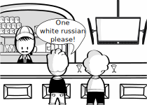
  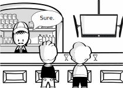
  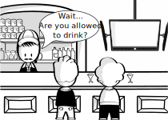
</div>

---

## Privileges of Dude

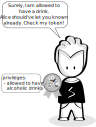<!-- .element height="600rem" -->

- The privileges/roles are part of the **Access Token**
- Dude received the **Access Token** together with the **ID Token** during the authentication flow
- For the sake of simplicity, both tokens are illustrated with one badge

---

## Access Token

```JavaScript
HEADER {
  "typ": "JWT"              //type of token
  "alg": "RS256"            //signing algorithm
}
PAYLOAD {
  "sub": "1234567890",      //subject, whom the token refers to
  "name": "Dude",           //name, identity information
  "iss": "Alice",           //issuer, who created and signed this token
  "exp": 1516239022,        //expiry date
  "roles": ["drink-alcohol"],
  ...
}
SIGNATURE [xxx]          //digital signature
```

Notes:
- The IDP has provided a roles claim where it declares the privileges/roles of the user

---

 <!-- .element height="100rem" -->

Work created with Scenes™ by SAP AppHaus (https://experience.sap.com/designservices/scenes)

---

# Questions?
