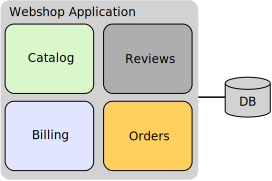
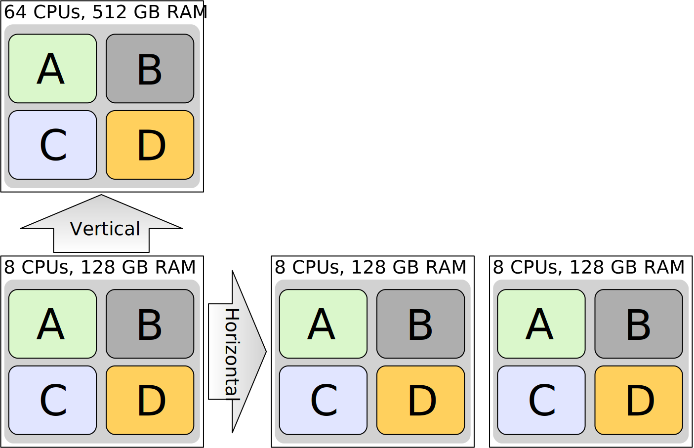
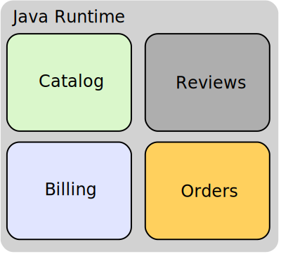
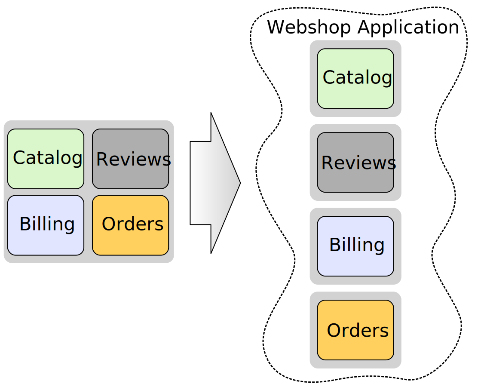
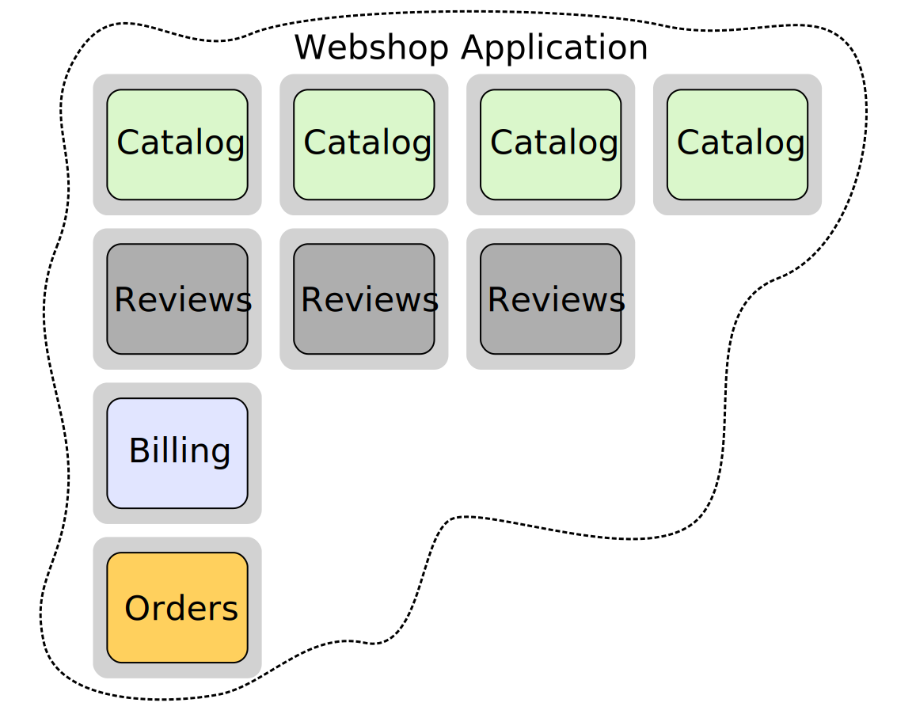
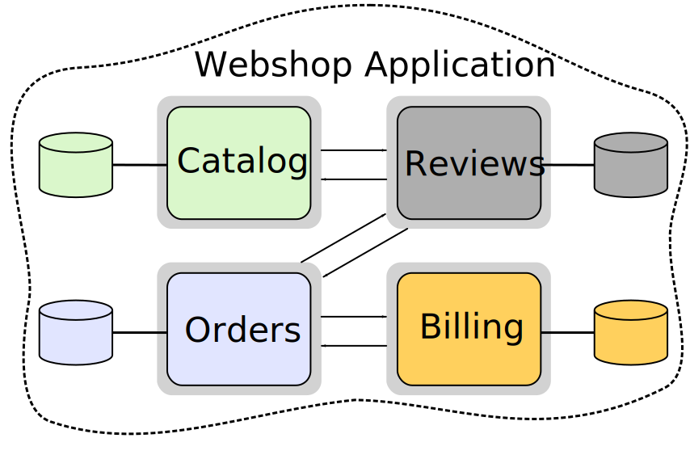

# Cloud and Microservices Introduction

---

### On-Premise vs. Public Cloud

- On-Premise:
  - On-premise systems hosted for 1 customer, if there is an issue only 1 customer is affected.
  - This means there are **X** different on-premise systems, each having its own administrator.

- Public Cloud:
  - Outages apply to **every** customer (as opposed to on-premise)
  - **We** have to ensure availability (the work of **X** administrators)

---

### Public Cloud Requirements

- **Boundless Scalability**: millions of users, thousands of servers, petabytes of data, globally distributed
- **High Availability**: zero downtime deployments, seamless failover
- **Fast Innovation**: develop, build and ship in short cycles within a day

Notes:

---

## Can a monolith fulfill these requirements?

 <!-- .element height="300rem" -->

---

## Scalability

 <!-- .element height="400rem" -->

Notes:
- Depending on the implementation of the monolith, horizontal scaling might not be possible (stateful monolith)
- Vertical scaling ("scaling up") is limited by available hardware, cost for this is non-linear. Requires downtime!
- Horizontal scaling ("scaling out") is unlimited, and has linear cost since we are simply adding another machine with the same capabilities.
- For the monolith in general: Scaling the app means that every functionality is scaled even though you only need to scale one particular component
  - you pay for extra resources you don't need, not optimally scaled

---

## Resilience & Isolation Of Failures

- one particular bug might crash the whole application

  
  

Notes:

---

## Technology Choice

- the whole application shares the same runtime
- no free choice of technology

 <!-- .element height="300rem" -->

Notes:
- technology might not match:
  - the skill set of the team
  - the technical requirements (performance, flexibility etc.) of the business capabilities
- using the right tools/technologies impacts productivity and performance

---

### Monolithic Architecture 

- 👍
  - Guaranteed transactional consistency for all data
  - Simple deployment, monitoring & troubleshooting
  - Code sharing easy
- 👎
  - Vertical scaling limited by hardware, cost non-linear
  - Systems poorly utilized (Test, Non-Peak)
  - HA Setup requires almost double the infrastructure
  - Must be built, tested, deployed and scaled as a whole

Notes:
- Systems poorly utilized: 
  - Testsystems need to be rolled out as a whole, probably including big amounts of data that is needed for the system to work properly even though the scope of the actual test scenario is lightweight and the setup should be too
  - Even when the application is not intensively used (non-peak) the full resources are provided
- HA: High-Availability
- "Monolith must be built, tested, deployed and scaled as a whole" -->(often results in: Big, infrequent releases with high risk)

---

### Monolithic Architecture != Legacy

- **CAN** be a valid architecture choice
- depends on your requirements

Notes:
  - is not considered a bad architecture (Monolith != Legacy)

---

# Microservices to the rescue...

---

### Idea Of Microservices

<!-- .element height="550rem" -->

Notes:
- rather than having the whole application 'smushed' into one monolith, break the monolith into smaller services 
  - each running in it's own process 
  - each developed and deployed independently

---

### Advantages Of Microservices

<!-- .element height="400rem" -->

- Unlimited and fine granular (auto-)scaling possible
- Poly skilled teams can work on services independently
- Deployable individually and frequently
  - Each service can be deployed independently 
- Lower Risk of deployment
- Free choice of technology for individual services

Notes:
- Lower Risk of deployment -> changes to a service affect only this particular microservice

---

### What are the properties of a Microservice Application?

<!-- .element height="450rem" -->

- a single application as a suite of small services
- with each service running in its own process
- communicating with lightweight mechanisms e.g. HTTP
- services are built around business capabilities
- own one part from DB to UI (including all data)

Notes:
- a single application as a suite of small services
  - The "application" is the sum of its services
- with each service running in its own process
  - Each service has it's own application lifecycle
  - Each service can be stopped, started, scaled and broken ;-) individually
- communicating with lightweight mechanisms e.g. HTTP
  - Microservices expose the business capabilities (which they encapsulate) to consumers and other microservices via one or more network endpoints (e.g. REST API)
- services are built around business capabilities
  - Each service has a clearly defined responsibility and interface 
- own one part from DB to UI
  - each service has it's own datastore (no sharing!)
  - the only way for other services to get information from the datastore is via the network endpoints of the owning service
  - Microservice is transaction boundary: Service can guarantee data consistency only for local data
    - Why no DB sharing?
    - If we share a db between services we break independent deployability, the schema is then a "shared implementation detail" of all services using it. 
    - This leads to tight coupling between the services. -> one db change requires updates to multiple services
    - We want to hide implementation details from the outside world so we are free to change/optimize them any time we want or need to
  - Ideally, even UI part is of service, Why?-> ...otherwise hard to keep independently deployable from UI  since UI would be a separate service.

---

### "Microservices are not a free lunch"

<!-- .element height="450rem" -->

- All communication via networks -> latency, failure
- Eventual consistency: Services can only guarantee consistency for their own data
- Harder to deploy, monitor and troubleshoot 
- We need to **"design for failure"** of all parts (hardware and software) 
- The more services you add, the more complex your system becomes
- Need additional technology in order to manage this complexity, which has its own learning curve

---

### Key Takeaways:
- We need to change the way we develop, in order to produce cloud ready software

- Microservices:
  - are an architecture pattern for building cloud applications
  - implement one concept well (from DB to UI)
  - can be developed and deployed independently, support continuous delivery
  - can use different technologies
  - allow resilience against software and hardware failures
  - are not a free lunch

Notes:

- allow resilience against software and hardware failures -> This resilience does not come for free and must be implemented by us!

---

# Questions?
