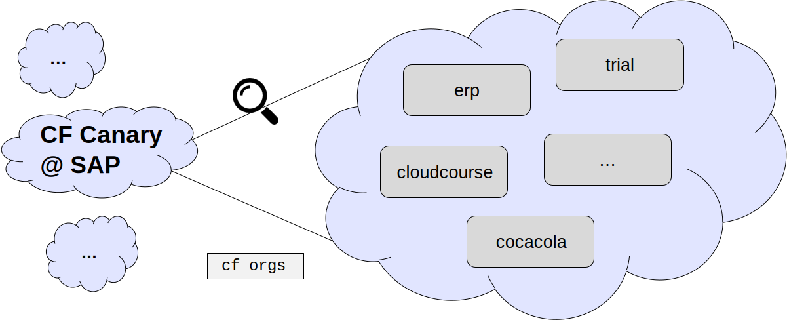
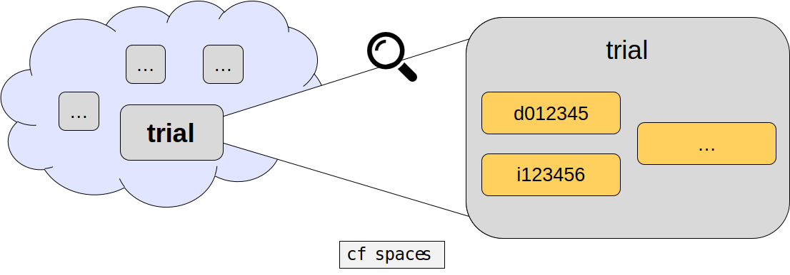
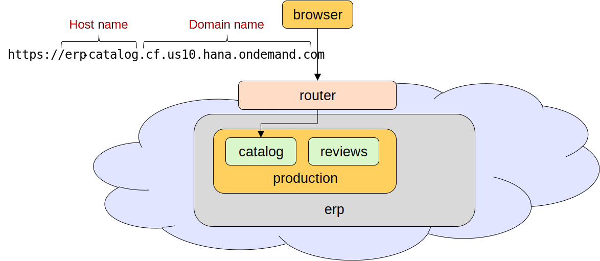

# Cloud Foundry Basics

---

### What is Cloud Foundry?


Notes:

- Top: Cloud Foundry applications can run in any Cloud Foundry hosting environment.
  This means that you can write your application once and then run it in computing centers of different providers.
  This prevents vendor lock-in.

- Left: It provides a choice of *development frameworks*.

- Right: It provides a set of *backing services* that can be used by your applications.
  These are services, that your application can connect to and expect to "simply be there".
  No need to install a database, mail service or whatever since it is provided by the hosting company.
  However, the offerings here differ from hoster to hoster.

---

### Multiple Cloud Providers - Unified Interface


---

### Organizations inside a Cloud Foundry Landscape



---

### Spaces inside an Organization



- A space has no specific semantic, possible uses are:
  - A space represents an environment for users (pictured)
  - A space represents a staging area, e.g. dev, integration, prod

---

### CF CLI

Your best friend: `cf help [ command ]`

Basic/common commands:

| Command                       | Description |
| ----------------------------- | ----------- |
| cf api URL                    | Connect to a Cloud Foundry provider (URL of cloud controller) |
| cf login                      | Log in as user (use SAP domain user and password) |
| cf target [ -o org -s space ] | Show or set a target space (where cf apps are deployed) |
| cf apps                       | Show running applications (microservices) |
| cf services                   | Show services (e.g. db, message queue, ...) |
| cf push                       | Push app in current directory to CF using local manifest |
<!-- .element style="font-size: x-large" -->

Notes:
- Use `cf help -a | grep <keyword>` to search for a command by keyword (comes handy if you don't remember the exact command)
- Many of the important commands have shorter aliases, e.g. `cf a` is short for `cf apps`

---

### Buildpacks

- Enable the usage of different programming languages and frameworks
- Are used to compile or prepare your app for launch
- When you push an app, Cloud Foundry automatically detects an appropriate buildpack for it
- Sources:
  - [Built-in](https://github.com/cloudfoundry-community/cf-docs-contrib/wiki/Buildpacks#built-in)
  - Cloud Platform (e.g. `sap_java_buildpack`)
  - [Cloud Foundry community](https://github.com/cloudfoundry-community/cf-docs-contrib/wiki/Buildpacks#community-created)
  - [Bring your own](https://docs.cloudfoundry.org/buildpacks/developing-buildpacks.html)
- `cf buildpacks` - list buildpacks available on your Cloud Platform (including built-ins)

Notes:

- Alternatively, Docker can be used. Read [this](https://www.suse.com/c/cloud-foundry-builpacks-dockerfiles/) to find out why you still might want to use buildpacks.

---

### Manifest

- Specifies application parameters to Cloud Foundry
- Used by `cf push`, which translates the information into more fine-grained commands and parameters
  - This means it is optional, you can do everything without the manifest
- By default CF expects it as `manifest.yml` in the root directory

```YAML
applications:
  - name: dummy-app-java
    memory: 800MB
    path: target/java-sample-app.jar
    buildpacks:
      - https://github.com/cloudfoundry/java-buildpack.git
```

Notes:

 - To achieve the above w/o manifest: `cf push dummy-app-java -m 800m -p=target/java-sample-app.jar -b https://github.com/cloudfoundry/java-buildpack.git`
 - If you also bind a backing service `my-db` in your manifest, then doing w/o manifest works like this:
   ```
   cf push dummy-app-java --no-start ...
   cf bind-service dummy-app-java my-db
   cf start dummy-app-java
   ```

---

### Routes



- Hostname != application name
- A hostname must be unique inside a domain


Notes:
- If you don't specify a route, **the hostname will be the application name by default!**
- In a big cloud instance, where almost everyone uses the same (default) domain, clashes often occur on generic/prominent hostnames
  - E.g. try to push an app with hostname `hello-world`, very likely it will fail because the URL `https://hello-world.cfapps...` is already taken by an app in another org/space
  - It is almost impossible to find out the org and space of the app that blocks the URL
- Multiple instances of the app (when scaling) map to the same URL
- A route can even map to multiple apps _in the same space_ (used e.g. to do a zero downtime deployment)
- The load will be balanced evenly across the different apps/instances of the same URL

---

### Apps

- The term "app" does not have any particular semantic in Cloud Foundry
- Example uses:
  - different microservices running as individual apps
  - different versions of the same microservice may also run in separate apps
- Use `cf scale` to run multiple instances of the same app

Notes:

- Running different versions of a microservice concurrently is useful for zero-downtime deployments -> Learn more about it in the [Cloud-Native Bootcamp](https://github.wdf.sap.corp/cloud-native-bootcamp/info#cloud-native-bootcamp)
- Scaling an app can be helpful to deal with high user load.

---

# Questions?
