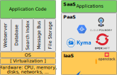

# Cloud Platform Fundamentals

---

### Cloud Computing Platforms

_a category of cloud computing services that provides a platform allowing customers to develop, run, and manage applications without the complexity of building and maintaining the infrastructure_

source: [Wikipedia](https://en.wikipedia.org/wiki/Platform_as_a_service)

---

### From Traditional Development to PaaS

- Providers/Vendors ensure scalability, availability, security, backups, ...

---

### Cloud Platforms

Pick the tools and technology that matches your business requirements and skills best!
([within certain boundaries](https://jam4.sapjam.com/groups/mYaTDaPrTFfwSbtvLnKjox/documents/DSANxIsFKFCBsZUQeXwJdR/slide_viewer))

Notes:

- Top: there's several vendors out there - the list is not complete!

- Bottom: You can pick from a shedload of technologies: programming languages / runtimes, data bases and other storages, message queues, ... - again, the list is not complete!

- Link: North star architecture - this is what SAP came up with to give guidance on technology. Although in theory you have an "infinite" number of choices, it probably makes sense to check for some "good defaults" first - keeping in mind sustainability and operability at a large scale

---

# Questions?
