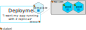

# Kubernetes

---

## Why use Kubernetes?

 <!-- .element style="max-height: 18rem;" -->

- After containerization new issues arise:
  - How should these containers work together?
  - What happens when a container crashes?

Notes:

- Recall containers? They are similar to VMs, but considered lightweight and provide extra [benefits](https://kubernetes.io/docs/concepts/overview/what-is-kubernetes/#going-back-in-time).

---

## What is Kubernetes?

- open-source container-orchestration system for automating application deployment, scaling and management
- originally designed by Google
- maintained by the Cloud Native Computing Foundation
- works with containerization tools like Docker
- the name originates from Greek -> 'helmsman' or 'pilot'
- common shortened name: 'K8s'

Notes:

- Kubernetes itself is something between infrastructure and platform.
    It is not as opinionated as Cloud Foundry but provides more abstraction than a "pure" IaaS provider.

---

## What K8s Provides You

<object data="./images/k8s_features.svg" type="image/svg+xml" width="850px" />

Notes:

- Service discovery & load balancing
  - K8s exposes a container using the DNS name or using their own IP address
  - if traffic to a container is high, K8s can load balance and distribute the network traffic so that the deployment is stable
- Self-healing
  - K8s restarts containers that fail, replaces containers, kills containers that don't respond to (user-defined) health-checks
  - advertises containers only when they are ready to serve
- Storage orchestration
  - K8s allows to automatically mount a storage system (e.g. local storages, public cloud providers)
- Secret and configuration management
  - K8s lets you store and manage sensitive information (e.g. passwords, OAuth tokens, SSH keys)
  - you can deploy and update secrets and app configs without rebuilding your container images
- Automated rollouts and rollbacks
  - K8s lets you describe the desired state for your deployed containers
  - changes the actual state to the desired state at a controlled rate
  - e.g. automate K8s to create new containers for your deployment, remove existing containers and adopt all their resources to the new container
- Automatic bin packing
  - you provide K8s with a cluster of nodes that it can use to run containerized tasks
  - tell K8s how much CPU and memory each container needs
  - K8s can fit containers onto your nodes to make an optimal use of your resources
- [Kubernetes Logo](https://github.com/kubernetes/kubernetes/blob/master/logo/logo.svg), by [Kubernetes](https://kubernetes.io/), licensed under [CC-BY-4.0](https://creativecommons.org/licenses/by/4.0/), embedded into another SVG without changes

---

## Kubernetes Objects

- Persistent entities in the Kubernetes system
- Used to represent the state of a cluster, e.g.:
    - What containerized applications are running (and on which nodes)
    - The resources available to those applications
    - The policies around how those applications behave (restart policies, upgrades, fault-tolerance, ...)
- A "record of intent" - your cluster's _desired state_
- To work with objects you need to use the Kubernetes API, for example via the CLI `kubectl`

Notes:

- "Record of intent": Once you create an object, the Kubernetes system will constantly work to ensure that object exists.
    By creating an object, you're effectively telling the Kubernetes system what you want your cluster's workload to look like.
- Most often, you provide the information to `kubectl` in a `.yaml` file.
- The format of the `spec` is different for every Kubernetes object, and contains nested fields specific to that object.
    See the [API Reference](https://kubernetes.io/docs/reference/generated/kubernetes-api/v1.19/) for precise information on a specific object.

---

## YAML Representation

```YAML
apiVersion: v1    # Each resource kind belongs to an api version
kind: Pod         # The "type" of the object
metadata:         # Data that helps to uniquely identify the object
  name: some-pod  # A name for the object
spec:             # "spec" contains all fields specific to the kind
  # ...
```

- Objects can be displayed/specified in the YAML format.
- These fields are required for every object.
- `metadata.name` will be omitted in the following examples.
- See [k8s-help.md](https://github.tools.sap/cloud-curriculum/materials/blob/main/cloud-platforms/kubernetes/k8s-help.md) for YAML examples

```shell
kubectl apply -f file.yaml
```

Notes:

- Objects can be created/reconfigured by applying YAML files.

---

## Pods

"smallest deployable units of computing"

 <!-- .element height="400rem" -->

Notes:

- Quote from: [Kubernetes](https://kubernetes.io/docs/concepts/workloads/pods/), 2020
- as in 'pod of whales'
- Is a group of one ore more containers with
  - shared storage/network resources
  - specification how to run the containers

---

## Deployments

 specify your _desired state_

 <!-- .element height="450rem" -->

Notes:

- Specify your desired state of an application
  - what application is deployed e.g.: image, version
  - how does it scale

---

### Deployments

- Provides declarative updates for Pods.
- Used to 
  - describe a desired state in a Deployment.
  - create new Deployments, remove or change existing ones
- Ensures that the desired amount of replica Pods is running at any given time.

Notes:

- The Deployment Controller changes the actual state to the desired state.

------

### Deployment Updates

 <!-- .element height="450rem" -->

Notes:

- Note to presenters: These vertical slides are optional. They may be useful to answer questions asked by participants.
- Deployments create ReplicaSets and label them.
- The ReplicaSets manage the pods and ensure that the desired amount of replicas is met.
- The Deployment finds its attached ReplicaSets through its selector.
- The ReplicaSet may add additional labels to the pods, e.g. a template hash. It also has a selector for the pods.
- The Deployment does not manage pods directly.

------

### Deployment Updates

 <!-- .element height="450rem" -->

Notes:

- When the Deployment's template gets updated, a new ReplicaSet is created to rollout the updated version.
- The pods from the existing ReplicaSet are terminated, so that there are always two replicas running.

------

### Deployment Updates

 <!-- .element height="450rem" -->

---

## Service

the Service provides a stable IP to reach a set of pods

 <!-- .element height="370rem" -->

Notes:

- Recap: Why do we need a stable IP?
  - A Pod can be killed and restarted (e.g. by the Deployment Controller), thus the IP changes
- When the targeted set includes more than one pod it also does load balancing

---

### Service Types

- ClusterIP
  - Service is only routable inside the Kubernetes cluster's subnet
  - Default service type, every service gets a cluster ip regardless of type
- LoadBalancer
  - Allocates a publicly routable IP address
  - Dependent on infrastructure provider
- ...[more](https://kubernetes.io/docs/concepts/services-networking/service/#publishing-services-service-types)

Notes:

- For LoadBalancer, all ports must have the same protocol (one of `TCP`, `UDP` and `SCTP`)
- (Transition to next slide) So we used Services to set up cross-node pod-to-pod communication
  - We still need a way to expose our Services externally to the internet
  - This is where Ingress comes into play

---

## Ingress

`ingress` (etymology): _the act of entering something_

<object data="./images/ingress.svg" type="image/svg+xml" style="width: 650px" />

Notes:

- in Kubernetes: 
  - An abstraction with a collection of rules that allow inbound connections to reach the cluster services
- An Ingress is one possibility to have one entrypoint to the outside world, however, you could also expose a service directly, see also [Stackoverflow comment](https://stackoverflow.com/questions/45079988/ingress-vs-load-balancer#:~:text=Ingress%20is%20actually%20NOT%20a,controllers%20that%20have%20different%20capabilities)

---

### Ingress

- May provide 
  - load balancing
  - SSL termination
  - name-based virtual hosting
- Ingress only gives a mechanism to define the routing rules
  - you must provide an Ingress controller which implements these rules, e.g. ingress-nginx

Notes:

- [Ingress vs. Service - a guide on when to use what](https://medium.com/google-cloud/kubernetes-nodeport-vs-loadbalancer-vs-ingress-when-should-i-use-what-922f010849e0)

---

## Persistence

demand PersistentVolume for your app

<object data="./images/persistence.svg" type="image/svg+xml" width="750rem" />

Notes:

- **PersistentVolume**s represent physical storage 
  - could link to a **NFS share**, some local storage cluster like **ceph** or storage provided by cloud platforms.
- **PersistentVolume**s can be provisioned by an administrator or dynamically.
  - dynamically: when there is no provisioned PV, a PV is provisioned by the cluster for the specific need of the claim
  - static (by admin): the admin creates a number of PV available for consumption
- **PersistentVolumeClaim**s are used to bind Persistent Volumes.
- The claim can be used by pods through the volume interface.

---

### Persistence

- Pods provide only ephemeral storage: When a pod dies, all data is gone
- Solution: Let the pod access persistent storage through volumes

Notes:

- Docker also has a concept of volumes, though it is somewhat looser and less managed.

---

## Volumes & VolumeMounts

- Just a directory, possibly with some data in it, accessible to the containers in a pod

```YAML
kind: Pod   # apiVersion and name omitted here
spec:
  volumes:  # provide direct access to storage
    - name: content-storage
      persistentVolumeClaim:
        claimName: nginx-pvc
  containers:
  - name: helper
    image: alpine:3.8
    volumeMounts: # Make the storage available in the container
    - name: content-storage
      mountPath: "/usr/share/nginx/html"
```

---

## PersistentVolumeClaim

- A **PersistentVolumeClaim** is a request for storage by a user.
- Allow a user to consume abstract storage resources.
- Claim a PersistentVolume and Kubernetes will make sure, that your claim is "bound"

---

## kubectl

- command line tool
  - lets you control K8s clusters
- configured with file named `config`
  - located in `$HOME/.kube` directory

- make use of other config-files by
  - setting `KUBECONFIG` env variable
  - providing `--kubeconfig` flag

Notes:

- main tool used when working with K8s

------

## Architecture Overview

<object data="./images/k8s_architecture_overview.svg" type="image/svg+xml" width="850px" />

Notes:
<!-- HINT: first, give a quick overview of "left" and "right" side -->
- Illustration of a cluster deployed with K8s
- Right side:
  - Set of worker machines, called nodes, that run containerized applications
    - every cluster has at least one worker node
  - The worker nodes host the Pods that are the components of the application
- Left side:
  - Control plane that manages the worker nodes and the Pods
  - makes global decisions about the cluster
    - e.g. scheduling
    - e.g. detecting and responding to cluster events (starting up a new pod when a deployments replica field is unsatisfied)
 <!-- HINT: then, give an overview to the single components -->
- API Server:
- center piece: all requests towards the cluster go through it
- exposes the K8s API via REST Operations
- lets you query and manipulate the state of objects (for example: Pods, Namespaces, ConfigMaps, and Events).
- kubectl:
  - CLI that talks via REST to the API Server
  - perform cluster administration tasks
  - user tasks like creating, deleting and modifying of resources
- etcd:
  - consistent and highly-available key-value store
  - used as K8s backing store for all cluster data
- kube-scheduler:
  - watches for newly created pods with no assigned node
  - selects a node for them to run on
  - factors for scheduling include: resource requirements, hardware/software/policy constraints, data locality etc...
- kube-controller-manager:
  - runs controller processes
  - various controllers are working to align the spec of a resource and its state
- kubelet:
  - runs on every node in a cluster
  - makes sure that containers are running in a Pod with the specified PodSpecs
- kube-proxy:
  - runs on each node and reflects services as defined in the Kubernetes API
- Container runtime:
  - the software responsible for running containers
  - supports Docker, containerd, CRI-O (any implementation of K8s Container Runtime Interface)


---

### kubectl Syntax

```bash
kubectl [command] [TYPE] [NAME] [flags]
```
- **command**: the operation, e.g.: `create`, `get`, `describe`, `delete`
- **TYPE**: the resource type, case-insensitive, singular/plural or abbreviated forms, e.g.: `ingress`, `svc`, `pods`
- **NAME**: name of the resource, case-sensitive, if omitted -> display all resources, e.g.: `nginx-66cf4d99b5-kpqgm`
- **flags**: optional flags, e.g.: `-f` or `--filename`

- if you need help, use `kubectl help`

---

# Questions?
