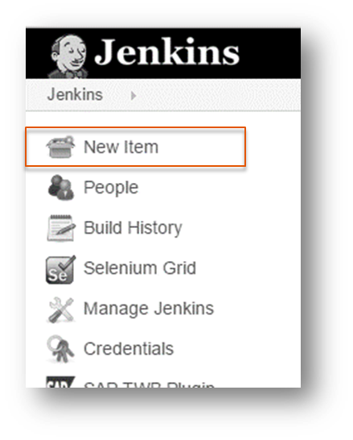
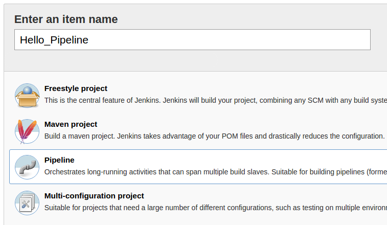
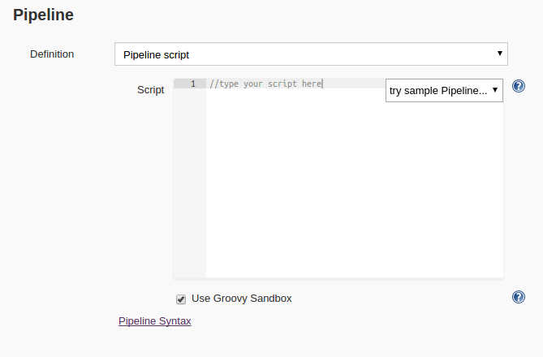
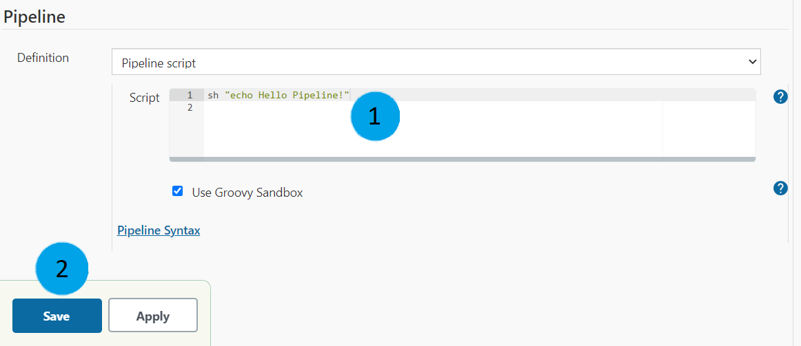
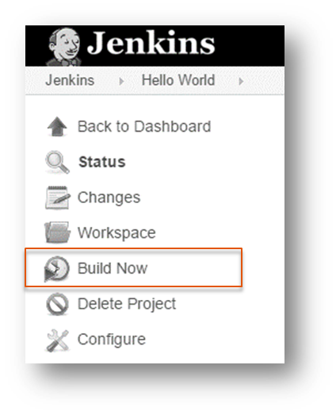
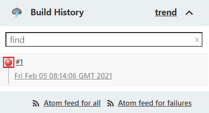
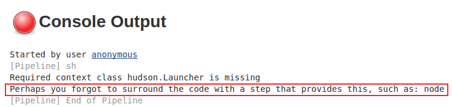
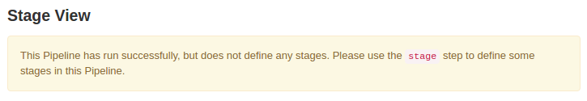
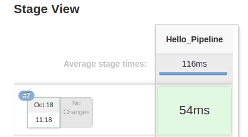

# Minimal Continuous Delivery Pipeline

_Disclaimer: We are [counting page hits](https://github.wdf.sap.corp/cloud-native-dev/usage-tracker) using a cookie to distinguish returning & new visitors._


## 👷‍♂️👷‍♀️ Audience

Developers with no knowledge of how to build a Jenkins CD pipeline

## 🎯 Learning Objectives

In this exercise you will learn how to:

- start and monitor a Jenkins server
- create and configure a Jenkins pipeline with a basic Groovy script
- externalize your pipeline script (Jenkinsfile) in your repository
- create pipeline stages for checkout, build, test and deployment
- add a basic automatic pipeline trigger


<!-- Prerequisites-->









### Other 🚀


- A [Cloud Foundry trial account](https://cockpit.hanatrial.ondemand.com/cockpit/#/home/trial) - make sure to use the Region __US East(VA) cf-us10__ as not all backing services are available in every region/landscape.

- Access to a Kubernetes Cluster.
  You can create a trial cluster with [Gardener](https://dashboard.garden.canary.k8s.ondemand.com/).
  Make sure to include the `Nginx Ingress` Add-on. (It can also be added later.)


## 🛫 Getting Started

Fork the application repository:


- Go to the GitHub repository https://github.tools.sap/cloud-curriculum/exercise-code-java and click on `fork` in the top right and choose your personal account as a target.

    You now should be able to find a copy of the repository under your personal account. (`https://github.tools.sap/<your c/d/i-number>/exercise-code-java`)

- Go to the GitHub repository https://github.tools.sap/cloud-curriculum/exercise-code-nodejs and click on `fork` in the top right and choose your personal account as a target.

    You now should be able to find a copy of the repository under your personal account. (`https://github.tools.sap/<your c/d/i-number>/exercise-code-nodejs`)


- The code base of the app we will be using is located in the **"minimal-pipeline" branch**.

## 📗 Exercises

### 1 - Start a Local Jenkins Instance

In the following exercises we will be running Jenkins locally in a docker container and use its graphical user interface via a browser to set up and configure pipelines.

#### 1.1 Start a local Jenkins

We have provided a Jenkins docker image in a public repository.

1. Log in to the Docker repository with the following command:
    ```shell
    docker login -u "claude" -p "9qR5hbhm7Dzw6BNZcRFv" cc-ms-k8s-training.common.repositories.cloud.sap
    ```


1. Now start a Jenkins container by executing following command:
    ```sh
    docker run -d --name my-jenkins -p 8080:8080 -v exercise_jenkins_home:/var/jenkins_home/ cc-ms-k8s-training.common.repositories.cloud.sap/cd-jenkins:latest
    ```

1. Start the Jenkins Docker Container

    1. Determine the `<GROUP-ID>` of `/var/run/docker.sock` by executing:
        ```shell
        docker run --rm -v /var/run/docker.sock:/var/run/docker.sock alpine stat -c %g /var/run/docker.sock
        ```

    1. Start a Jenkins container by executing the command: (substitute `<GROUP-ID>`):
        ```sh
        docker run -d --name my-jenkins -p 8080:8080 -v exercise_jenkins_home:/var/jenkins_home/ -v /var/run/docker.sock:/var/run/docker.sock --group-add <GROUP-ID> cc-ms-k8s-training.common.repositories.cloud.sap/cd-jenkins:latest
        ```

        ???warning "Using Git Bash for Windows? - Path conversion"
            If you are using "Git Bash for Windows" it will try to convert the occurrences of `/var/run/docker.sock` to Windows paths, which will make the command fail.
            Prefix them with an extra forward slash to disable the automatic path conversion: `//var/run/docker.sock`.

    1. Run the following command to permit docker-in-docker
        ```sh
        docker exec -it -u root my-jenkins bash -c "chmod g+w /var/run/docker.sock"
        ```



<br/>

You can stop it with the command `docker stop my-jenkins` and start it again using `docker start my-jenkins`.
The server automatically stops on a shutdown of your computer.
You have to start the server again with `docker start my-jenkins`.

#### 1.2 Visit Your Jenkins in a Browser

Access the Jenkins GUI at [localhost:8080](http://localhost:8080) in a web browser of your choice.

You will be using this interface to set up and configure your pipeline.

### 2 - Hello Pipeline

Let's set up and configure a Jenkins pipeline.
The goal is to simply get the pipeline running and to print a "Hello Pipeline!" to the console.

#### 2.1 Create a Pipeline Job

1. Navigate to the root/main page of your Jenkins Server (`localhost:8080` in your browser).
1. On the upper left corner of the screen, click on `New Item`.

    {: width="200" }

1. Give it the name `Hello_Pipeline` and select `Pipeline`.

    {: width="600" }

1. Press the button `OK`.

The Jenkins Job is now created and the configuration interface is shown to you.

#### 2.2 Write a Step

There is a section called `Pipeline` which contains an input field labeled "Script".
This is where you can type the Pipeline script.

{: width="600" }

1. Paste the following code as `Pipeline script`:

    ```GROOVY
    sh "echo Hello Pipeline!"
    ```

1. Save the job.

    {: width="600" }

1. Run the job by clicking on `Build Now` on the left side of the window.

    {: width="200" }

    You will find the build results in the `Build History` window right underneath the menu.

1. Oops, the job failed to build (it's "red"). To see what went wrong, open the console log by clicking on the circle next to the job number and check what has been logged there.

    {: width="300" }

1. You should find this remark: `Perhaps you forgot to surround the code with a step that provides this, such as: node`

    {: width="600" }

#### 2.3 Use `Node`

It is best practice to do all material work, such as building or running shell scripts, within nodes.
For most parts it is even required.

1. Now go ahead and fix the error. Click on your `Hello_Pipeline` job. Find and click `Configure` on the left panel to enter the configuration page. In the section `Pipeline`, wrap the code of the previous step in a `node` so it looks like the snippet below:

    ```GROOVY
    node {
        sh "echo Hello Pipeline!"
    }
    ```

1. Save and run the job again.
1. Yeah, green light! Build success! But can you see a `Stage View` on the right side? It is empty and you should see the description: `This Pipeline has run successfully, but does not define any stages. Please use the stage step to define some stages in this Pipeline.`

{: width="600" }

#### 2.4 Visualize `Stage`

Let's follow the advice of Jenkins and create a stage for our task.

1. Wrap the `echo` command into a `stage` named `Hello_Pipeline`:

    ```GROOVY
    node {
        stage('Hello_Pipeline') {
            sh "echo Hello Pipeline!"
        }
    }
    ```

1. Save and run the job again. You should now be able to see the `Stage View`

{: width="300" }

??? info "The nesting order of elements matters"
    In this case the `stage`-step is inside the `node`-step. It is possible to switch things around and place the `node`-step inside the `stage`-step.
    In the exercises we will keep the `stage`-step inside of the `node`-step and use the `node`-steps as the first level building blocks of our pipeline to get the benefit of reusing the same workspace throughout the stages.
    But this is not always desirable. In our jenkins the amount of nodes that can be used at the same time is limited.
    Therefore using the same node for the complete pipeline will block the node for the entire run, even though some steps might not need a workspace and could run without a node.

### 3 - Jenkinsfile

In the previous exercise we defined our pipeline directly in the job configuration; there is a better way.
The pipeline script can be externalized into a file and stored in a version control system like git.
The default file name is `Jenkinsfile`, but it's configurable.

#### 3.1 Create a Jenkinsfile

The pipeline we are going to write should run the continuous integration process for our sample app.
Therefore it is beneficial to store our new `Jenkinsfile` in the same repository as the source code of our app.

1. Go to your personal fork of the application repository you created in the [Getting Started Section](http://localhost:8000/continuous-delivery/java/#getting-started) in a browser and make sure you are on the `minimal-pipeline`- branch.
1. Create a new File named `Jenkinsfile` with the following content:

    ```GROOVY
    pipeline {
        agent any
        stages {
            stage('Hello_Pipeline') {
                steps {
                    sh "echo Hello Pipeline!"
                }
            }
        }
    }
    ```

1. Commit it.

#### 3.2 Use Jenkinsfile in Job

Now we need to create a new Jenkins job, which uses the `Jenkinsfile` we just created.

Of course we could also reconfigure our `Hello_Pipeline`, but since we want to change the content of the pipeline soon the name is no longer adequate.

1. Go to Jenkins (http://localhost:8080)
1. In the upper left corner of the screen, click on `New Item`.
1. Enter `Greetings` as name and select `Pipeline`.
1. Press the button `OK`.

1. In the configuration page in the section `Pipeline` choose `Pipeline script from SCM` as `Definition`


1. For `SCM` choose `Git` and in the field `Repository URL` place the https-URL of your git repository `https://github.tools.sap/<your-c/d/i-number>/exercise-code-java`

1. For `SCM` choose `Git` and in the field `Repository URL` place the https-URL of your git repository `https://github.tools.sap/<your-c/d/i-number>/exercise-code-nodejs`


1. In the `Branches to build` field, enter the branch name `minimal-pipeline`
1. You can specify the name of our jenkins script file in the field `Script Path`. `Jenkinsfile` should already be in there.

!!! error "Failed to connect to repository"
    If you are seeing an error message, stating that jenkins cannot reach the repository due to missing authentication, don't worry!
    That will be taken care of in the next task.

#### 3.3 Add Credentials

To enable Jenkins to pull from the repository it needs to authenticate towards GitHub. You can configure Jenkins to use a personal access token for GitHub authentication.

1. Get an access token using our tool [here](https://tokentool-tools-gh.cfapps.eu10.hana.ondemand.com/).
   After logging in to github with your SAP-Credentials you will see a page containing only an alphanumeric string, this string is your token.

    ??? info "The "proper" way to create personal access tokens"
        The tool is just a shortcut for trainings. The "proper" way to create personal access tokens on GitHub is described [here](https://docs.github.com/en/github/authenticating-to-github/creating-a-personal-access-token). For the exercise you would require a token with the scope "repo (Full control of private repositories)"

1. Back in the pipeline configuration click `Add` next to the credentials selection below the repository URL.
1. Select `Jenkins` as the credential provider.
1. Select the `Kind` "Username with password" (should be the default).
1. Select the `Scope` "Global (Jenkins, nodes, items, all child items, etc)".
1. Supply your GitHub `Username` (your c/d/i-number).
1. Paste your personal access token as `Password`.
1. Leave the `ID` blank to let Jenkins create a unique identifier for this credential.
1. Provide an optional `Description` for this credential, e.g. "access my personal repo".
1. Click `Add`.
1. Select the created credential in the dropdown.
1. Verify that the error message disappears.
1. Click `Save`.

#### 3.4 Run the Pipeline

1. Open up the overview page of the "Greetings" job in Jenkins and click `Build Now` on the left hand side.

You should observe the exact same pipeline run as in the previous exercise, but this time the pipeline script is under version control.

### 4 - Build

One principle of Continuous Integration is that every commit gets verified that it does not break anything.


The easiest way to verify source code changes of a maven managed java application would be to execute `mvn verify`, which in our case executes the unit tests, compiles the java code, and bundles the compiled byte code into a `.jar`-file.

The easiest way to verify source code changes in a node-project is to install the dependencies with `npm clean-install` (short: `npm ci`) and then run the tests with `npm test`.


#### 4.1 Checkout & Test

We will start with editing the Jenkinsfile in your forked repository

1. Rename the first stage in your pipeline to `Checkout`.
1. Replace the content of `steps` with the following:
    ```GROOVY
    deleteDir()
    checkout scm
    ```

    ??? info "Steps Walkthrough"
        - `deleteDir()`: [recursively delete the current directory](https://www.jenkins.io/doc/pipeline/steps/workflow-basic-steps/#deletedir-recursively-delete-the-current-directory-from-the-workspace) to avoid issues caused by files left over from a previous pipeline execution
        - `checkout scm`: checkout code from source control; scm is a special variable which instructs the checkout step to clone from the repository which is configured in the pipeline

1. Add a new `stage` with the name `Test`.


1. Make the new stage contain the following step: `sh 'mvn verify'`

1. Make the new stage contain a step for each of the following snippets:
    - `sh 'npm clean-install'`
    - `sh 'npm test'`

1. Commit the changes and execute the pipeline in the Jenkins UI.

The pipeline should execute successfully and you should be able to see the test results in the build's console output.

#### 4.2 Add a basic automatic pipeline trigger

1. Click on `Configure` (two items below `Build Now`) to get back to the configuration screen for your job.
1. Scroll down to the `Build Triggers`-section and check the box for `Poll SCM`.
1. As `Schedule` put in `* * * * *`.

    This is cron notation for "every minute".
    In the [Related Topics section](#related-topics) there is a link to catch up on cron jobs.

1. Save your changes.

The jenkins-job is now configured to check every minute if there are any new commits on the master branch.
If there are some changes, the pipeline will run automatically.
You can test this by editing a file, for example add a new line in the `README.md`.

!!! warning "Do you really mean "every minute" when you say "* * * * *"?"
    You probably have seen such a warning in the Jenkins UI.
    Of course using this technique in many jobs can easily cause huge traffic and load onto the network and Jenkins.
    Additionally, not every commit would cause a build if there are multiple commits a minute.

    There are better ways to do this, e.g. by using web-hooks, but for now we will stick with this simple approach.

### 5 - Deployment

So far you have built a Continuous Integration pipeline.
To have a Continuous Deployment pipeline, deployment must be automated as well.

#### 5.1 Configure the Deployment


1. Open the file `manifest.yaml` of your forked repository and replace `<YOUR c/d/i-number>` with your actual c/d/i-number (with the letter in lowercase).
1. Commit the changes.

1. Open the file `greetings.yaml` of your forked repository and replace `<YOUR c/d/i-number>` with your actual c/d/i-number (with the letter in lowercase).
1. Replace all instances of `<CLUSTER>` and `<PROJECT>` with the names of your Gardener cluster and project, respectively.

??? tip "Don't know what your cluster and project names are?"
    You can determine the cluster and project names by running the following command:
        ```shell
        kubectl cluster-info
        ```
    It should print a message similar to the following, with `<CLUSTER>` and `<PROJECT>` being replaced:
        ```
        Kubernetes master is running at https://api.<CLUSTER>.<PROJECT>.shoot.canary.k8s-hana.ondemand.com
        ```
    If your client is not connected to the cluster you can see the first exercise of the [Kubernetes topic](../../cloud-platforms/kubernetes-java/#1-accessing-the-cluster) to find out how to configure `kubectl`.



#### 5.2 Add Cloud Foundry Credentials
To be able to push the application to Cloud Foundry, Jenkins needs the relevant credentials

#### 5.2 Add Docker Registry Credentials
To be able to push built images to the Docker registry, Jenkins needs the relevant credentials.


1. <a href="http://localhost:8080/credentials/store/system/domain/_/" target="_blank">Click here</a> to go to the credentials page.
1. Click on `Add Credentials`.

1. Enter the username and password for Cloud Foundry

    !!! warning "Does your personal Cloud Foundry account have 2FA enabled?"
        If your account has 2FA enabled, logging in to Cloud Foundry is only possible using the `--sso` parameter e.g. `cf login --sso`.

        If you have never used `--sso` you can stop reading here and just use your personal user credentials for this exercise.

        Otherwise follow these steps:

        1. Grant push privileges for your space to our technical user

            ```bash
            cf set-space-role DL_564AF14D7BCF842F5A00004E@exchange.sap.corp <org> <space> SpaceDeveloper
            ```

        1. In Jenkins, use the username `DL_564AF14D7BCF842F5A00004E@exchange.sap.corp` and password `c_fhAz8Ko8UAxlrgZBb` instead of your personal credentials

        **DO NOT USE THESE CREDENTIALS FOR ANYTHING BUT THIS EXERCISE AND ONLY FOR TRIAL SPACES - YOU HAVE BEEN WARNED.**

1. Enter the following ID: `cf-user`
1. Click `OK`.


1. Enter the following username: `claude`
1. Enter the following password: `9qR5hbhm7Dzw6BNZcRFv`
1. Enter the following ID: `registry-user`
1. Click `OK`.

#### 5.3 Add Kubernetes Cluster Credentials

To be able to change the desired state of your Kubernetes cluster, Jenkins needs the relevant credentials.
The cluster credentials are included in the `Kubeconfig` file provided by Gardener.

1. Download the `Kubeconfig` file from Gardener, if you haven't already.
1. Click on `Add Credentials` to add another set of credentials.
1. Choose the kind `secret file`.
1. Choose the `Kubeconfig` file which you downloaded from Gardener.
1. Enter the ID `kubeconfig`.
1. Click `OK`.



#### 5.3 Add Deployment Stage

#### 5.4 Build the Docker Image


The `withCredentials` function allows credentials to be bound to environment variables for use by miscellaneous build steps.
Credentials can be referenced by ID with the `usernamePassword` function.


1. Add a new stage with the name `Build & Push Docker Image`.
1. In it, add a step to build the Docker image (substitute `<YOUR c/d/i-number>`):

    ```GROOVY
    sh 'docker build -t cc-ms-k8s-training.common.repositories.cloud.sap/cd-<YOUR c/d/i-number> .'
    ```

1. Add another step to log in to the Docker Registry:

    ```GROOVY
    withCredentials([usernamePassword(credentialsId: 'registry-user', usernameVariable: 'USERNAME', passwordVariable: 'PASSWORD')]) {
        sh 'docker login -u $USERNAME -p $PASSWORD cc-ms-k8s-training.common.repositories.cloud.sap'
    }
    ```

1. Add another step to push the image to the registry (again, substitute `<YOUR c/d/i-number>`):

    ```GROOVY
    sh 'docker push cc-ms-k8s-training.common.repositories.cloud.sap/cd-<YOUR c/d/i-number>'
    ```

#### 5.5 Add Deployment Stage



1. Add a new stage with the name `Deployment` and the following steps:
    1. Log in to your Cloud Foundry space:

        ```GROOVY
        withCredentials([usernamePassword(credentialsId: 'cf-user', usernameVariable: 'USERNAME', passwordVariable: 'PASSWORD')]) {
            sh 'cf login -a https://api.cf.us10.hana.ondemand.com -u $USERNAME -p $PASSWORD -o <ORGANIZATION> -s <SPACE>'
        }
        ```

        Remember to replace the placeholders `<ORGANIZATION>` and `<SPACE>`.

        ??? example "Need help?"
            Run the following command to see your Cloud Foundry `org` and `space`:
                ```shell
                cf target
                ```

    1. Push the application:
        ```GROOVY
        sh 'cf push greetings -f manifest.yaml'
        ```

1. Add a new stage with the name `Deployment` which applies the `greetings.yaml` file:

    ```GROOVY
    withKubeConfig([credentialsId: 'kubeconfig']) {
        sh 'kubectl apply -f greetings.yaml'
    }
    ```


1. Commit the changes to the `Jenkinsfile` and wait for the pipeline to execute successfully.

1. Navigate to the route you specified earlier (`greetings-<YOUR c/d/i-number>.cfapps.us10.hana.ondemand.com`) in your web browser and append `/hello`.

1. Navigate to the route you specified earlier (`app.ingress.<CLUSTER>.<PROJECT>.shoot.canary.k8s-hana.ondemand.com`) in your web browser and append `/hello`.


## 🏁 Summary

Good job!
In this module you learned how to set up a simple CD pipeline with Jenkins.
You ensured that the pipeline script is checked into version control and that pushed commits are verified.
You made the pipeline frequently check for new commits and execute in case there are any.
Lastly, you made it deploy your application without the need for manual intervention.

## 📚 Recommended Reading

- [Martin Fowler - Continuous Integration](https://martinfowler.com/articles/continuousIntegration.html)
- [Writing and understanding pipeline scripts](https://github.com/jenkinsci/pipeline-plugin/blob/master/TUTORIAL.md)
- [General Groovy documentation](http://groovy-lang.org/documentation.html)
- [What is a Jenkins Pipeline](https://jenkins.io/doc/book/pipeline/)
- [Jenkins Pipeline Steps Reference](https://jenkins.io/doc/pipeline/steps/)
- [GitHub Docs - About webhooks](https://docs.github.com/en/developers/webhooks-and-events/about-webhooks)

## 🔗 Related Topics

- [cron at Wikipedia](https://en.wikipedia.org/wiki/Cron)
- [Hyperspace - SAP Pipeline Onboarding](https://hyperspace.tools.sap/)
- [Github Actions@SAP(Beta)](https://pages.github.tools.sap/github/features-and-usecases/features/actions/status)
- [Piper](https://github.wdf.sap.corp/pages/ContinuousDelivery/piper-doc/)
