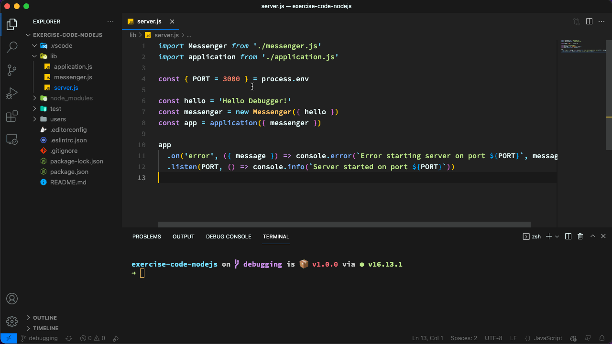
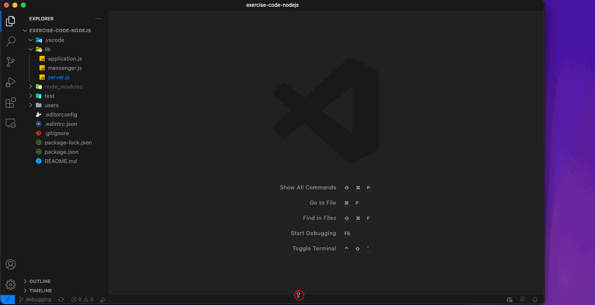
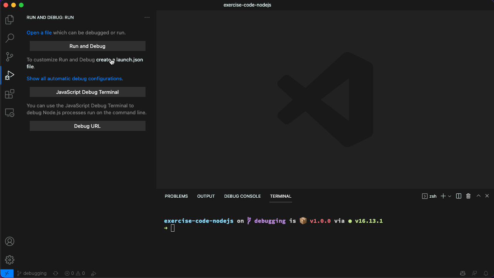
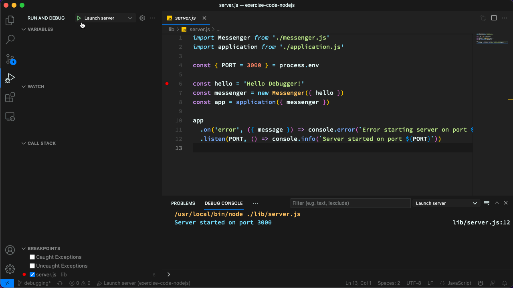

# 🔮 Debugging in Node.js

_Disclaimer: We are [counting page hits](https://github.wdf.sap.corp/cloud-native-dev/usage-tracker) using a cookie to distinguish returning & new visitors._


## Audience 👩‍💻🧑‍💻

Developers with basic knowledge of JavaScript who want to learn more about [Debugging](https://en.wikipedia.org/wiki/Debugger){target=_blank} in [Node.js](https://nodejs.org/en/){target=_blank}.

## 🎯 Learning Objectives

In this exercise you will learn

- how to use debug [Node.js](https://nodejs.org/en/){target=_blank} programs in [Visual Studio Code](https://code.visualstudio.com/){target=_blank}

<!-- Prerequisites-->


## 🛫 Getting Started





--8<--- "snippets/npm-install-dependencies.md"

## 📗 Exercises

For this exercise we are assuming that you are using [Visual Studio Code](https://code.visualstudio.com/){target=_blank}. For other IDEs the steps should be similar. Please check the respective documentation for the exact steps.

### 1 Start and Stop the Debugger 📟

There are serveral ways to start a debggung session in VS Code.

#### Run and Debug

1. Open the main entry file for our program `lib/server.js` in the editor

1. In the **Activity bar** of the left side of the screen click on the  **Run and Debug** icon.

1. Click on the button labeled "Run and Debug".

    This will start the server and attach the debugger to it.

    If you are prompted for an environment, choose "Node.js".

1. Stop the debugger for now by clicking on the **Stop** icon.



#### JavaScript Debug Terminal

1. Open a new **Terminal**

1. Once the Terminal has opened click the **Launch Profile** button next to the *New Terminal* button in the upper right corner and select **JavaScript Debug Terminal**

1. Run `npm start` in the newly opened *JavaScript Debug Terminal* to start the server and attach the debugger to it.

1. Enter **Ctrl+C** to stop the server and debugger for now.



#### Launch configurations

1. In the **Activity bar** of the left side of the screen click on the  **Run and Debug** icon.

1. Click on **create a launch.json file**

1. Select environment: **Node.js**

    This will create a `launch.json` file in folder `.vscode` the root of the project.

1. Change the `name` property of your configuration, e.g. to `Launch server` and make sure that the `program` property is set to `${workspaceFolder}/lib/server.js` (or `${workspaceFolder}\\lib\\server.js` on Windows).

    ```json
    {
      "version": "0.2.0",
      "configurations": [
        {
          "type": "pwa-node",
          "request": "launch",
          "name": "Launch server",
          "skipFiles": [
            "<node_internals>/**"
          ],
          "program": "${workspaceFolder}/lib/server.js"
        }
      ]
    }
    ```

    !!! tip "Launch configurations"

        You can use "IntelliSense" to learn about possible attributes in your `.vscode/launch.json`. Hover to view descriptions of existing attributes. For more information, visit: https://go.microsoft.com/fwlink/?linkid=830387

1. Make sure the `Launch server` configuration is selected in the **Launch** dropdown and press the *Start Debugging* button.

     This will start the server and attach the debugger to it.

1. Stop the debugger for now by clicking on the **Stop** icon.



### 2 Set some Breakpoints 🚩

1. Open file `server.js` in the editor.

1. Put a breakpoint in line `6` by clicking left of the line number.

1. Start the server and attach the debugger to it with whatever method you prefer.

    The debugger will stop at the breakpoint.

1. Use `Step Into` and `Step Over` to step through the code when starting the server.

    Notice the `Variables` and `Call Stack` panels.

    You can also define `Watch` expressions.



### 3 Debug an Issue 🛑

Something seems to be wrong with the server.

We have configured a `hello` message `'Hello Debugger!'` in the `server.js` file.

But if we hit the [`/hello`](http://localhost:3000/hello){target=_blank} endpoint we get a `'Hello World!'` message.

Let's debug what is wrong.

1. Start the server and attach the debugger to it with whatever method you prefer.

1. Put a breakpoint in line `6` in file `application.js`.

1. Hit the [`/hello`](http://localhost:3000/hello){target=_blank} endpoint, start debugging, and fix the issue so that the server returns the `'Hello Debugger!'` message.

!!! info "Responses from the server"

    Keep in mind that while debugging, the server will not send responses to the client until you resume the program execution.

## 🏁 Summary

Nice job! 🥳 You have successfully learned how to debug [Node.js](https://nodejs.org/en/){target=_blank} applications in [Visual Studio Code](https://code.visualstudio.com/){target=_blank}.

## 📚 Recommended Readings

- [Debugging in Visual Studio Code](https://code.visualstudio.com/docs/editor/debugging){target=_blank}
