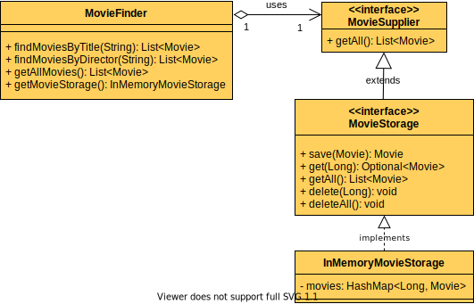

# Decoupling & Test Isolation

_Disclaimer: We are [counting page hits](https://github.wdf.sap.corp/cloud-native-dev/usage-tracker) using a cookie to distinguish returning & new visitors._


## 👷‍♂️👷‍♀️ Audience
Java Developers that want to learn how tightly coupled code can be decoupled

## 🎯 Learning Objectives

In this exercise you will learn...

- how to decouple your code by using the Dependency Inversion Principle (DIP) and Dependency Injection (DI)
- how to isolate your tests
- how to use Mockito for basic mocking

<!-- Prerequisites-->


## 🛫 Getting Started





Run the tests:

=== "Command Line"



=== "Spring Tool Suite"



=== "IntelliJ"




The tests should be passing.
Make sure that the tests are passing after each exericse.


## 🔍 Code Introduction

The main entity of the code is the `Movie` class.
It consists of the fields `title`, `director` and `id`.

The movie entities can be persisted to an in-memory storage using the class `InMemoryMovieStorage`.
It provides methods to save, retrieve and delete a movie.

Finally we have the `MovieFinder`-class, which is responsible for retrieving Movies from the storage, filtered by title or director.
The exercise will focus on the `MovieFinder` class and the corresponding tests.

## 📗 Exercises

In the following exercises we will tackle the dependencies of the class `MovieFinder`.
Step by step we will adjust the dependency of this class to make it more loosely coupled.
By isolating the unit tests from external dependencies, we will be able to test the core functionality of `MovieFinder` in isolation.

### 1 - Implement Dependency Inversion Principle (DIP)

The **Dependency Inversion Principle** states that:

>1. High-level modules should not depend on low-level modules.
    Both should depend on the abstraction.
 2. Abstractions should not depend on details.
    Details should depend on the abstraction. (source: [Wikipedia](https://en.wikipedia.org/wiki/Dependency_inversion_principle))

Let's understand this principle in the context of our code.


The `MovieFinder`-class uses the concrete `InMemoryMovieStorage`-class, therefore it is tightly coupled.

In our scenario, the `MovieFinder` class is the high-level module, since it's depending on another module (`InMemoryMovieStorage`).
According to DIP we should make it depend on an abstraction.

#### 1.1 Create an Abstraction of `InMemoryMovieStorage`

The `InMemoryMovieStorage`-class provides methods to save, retrieve and delete a movie.
To implement this functionality it uses a `HashMap`, which is an implementation detail; The method signature overall could be generalized in a java interface.
Hence we could let other storage classes implement this interface to feature a new storage type (e.g. database).

Let's create the interface `MovieStorage`:

1. In the class signature of `InMemoryMovieStorage` add `implements MovieStorage`.
1. Let the IDE create the missing interface.

#### 1.2 Pull Abstract Methods Up ⬆️

The methods inside `InMemoryMovieStorage` should be declared in the interface, but implemented in the concrete class.

Therefore, pull the method declarations up to the `MovieStorage`-interface and override them in the `InMemoryMovieStorage`-class.

Use your IDE's **Pull (Members) Up...** refactoring on the `InMemoryMovieStorage` class.

=== "IntelliJ"
    1. Use the **Pull Members Up...** refactoring.
    1. Select all **methods** (leave out `movies`-field) and make sure the **Make Abstract** checkbox is checked for all.
    1. Click `Refactor`

=== "Spring Tool Suite"
    1. Use the **Pull Up...** refactoring.
    1. In the "Pull Up" dialogue, select all **methods** (leave out `movies`-field) using the checkboxes.
    1. Mark all methods, and use the **Set Action** button to change the action for both methods to **declare abstract in destination**
    1. Click `Finish`

??? info "Extract Interface Refactoring"
    Note that your IDEs (IntelliJ & Spring Tool Suite) are capable to do the previous steps 2.1 and 2.2 in one go with the **Extract interface...** refactoring.
    Here we did it separately, for a better comprehension.

#### 1.3 Loosen the Coupling in `MovieFinder`

Finally, go to the `MovieFinder`-class and make it use the new abstraction (Your IDE might already have done this, but please check).

1. Change the type of the `movieStorage`-variable from `InMemoryMovieStorage` to `MovieStorage`.
1. Change the return type of the getter-method as well (from `InMemoryMovieStorage` to `MovieStorage`).

The high-level module `MovieFinder` is now no longer dependent on a low-level module.
The detail of how the movie storage is implemented is hidden behind the interface.
We have gained flexibility since we could now introduce new implementations of `MovieStorage` and use them in the `MovieFinder`-class.

### 2 - Isolate `MovieFinderTest`

The tests in `MovieFinderTest`-class rely upon the proper functioning of the `MovieStorage`-implementation, and consequently of the `InMemoryMovieStorage`.
Due to the fact that we use the `InMemoryMovieStorage` directly in the `MovieFinderTest`-class, if the `InMemoryMovieStorage` gets broken by new bugs, the tests for `MovieFinder` will probably fail as well.
How can we isolate our test-class from the functionality of the dependencies of the productive-class? 

#### 2.1 Write a Stub for `MovieStorage`

It would be nice if we had an implementation of `MovieStorage` that could just provide us with the values that we need in order to test the core functionality of `MovieFinder` independently.

Since we've created an abstraction (`MovieStorage`) in the previous exercise, we can now create our own implementation of it, just for testing.

1. Go to `src/test/java` and create a class `MovieStorageStub` in the `com.sap.cc.movies` package.

1. Let the new class implement the interface `MovieStorage` and let your IDE generate the overriden methods.

1. Implement the `getAll`-method to make it return the movie-list from `MovieFixtures`.


    ??? example "Need Help?"
        ```JAVA
        
        import java.util.List;
        import java.util.Optional;

        import static com.sap.cc.movies.MovieFixtures.MOVIES;

        public class MovieStorageStub implements MovieStorage {

            List<Movie> movies = MOVIES;
            ...
            @Override
            public List<Movie> getAll() {
                return movies;
            }
            ....
        }

        ```
    The `MovieFinder`-class only uses the `getAll`-method, hence only this method is implemented in the stub.

#### 2.2 Inject MovieStorageStub

1. In the `MovieFinder`-class create a setter-method for the `movieStorage` field .

1. In the `MovieFinderTest`-class' `setUp`-method remove the existing code and use the setter-method to pass a new instance of `MovieStorageStub` to the `movieFinder`.

### 3 - Use Dependency Injection (DI)

In the previous exercise we already injected the dependency (`MovieStorageStub`) using "Setter Injection".
In this particular exercise we want to use "Constructor Injection".
By using Constructor Injection for `MovieFinder`, we explicitly specify that for an instantiation of that class the dependency is a required property.

1. Update the constructor of the `MovieFinder`-class to take `MovieStorage movieStorage` as a constructor parameter and assign it's value to the class field `this.movieStorage = movieStorage` (instead of creating a new instance as it is currently implemented).

1. In the `MovieFinderTest`-class use Constructor Injection to instantiate `MovieFinder` and pass in the `MovieStorageStub` as the dependency.

1. You can remove the code in the set `setUp` method since the dependency is now injected via the constructor

### 4 - Use Mockito

We used the `MovieStorageStub` to provide canned answers to the calls towards the `MovieStorage`.
Using Mockito we won't have to write [test doubles](https://martinfowler.com/bliki/TestDouble.html) manually.
Within our test class we can create test doubles with Mockito and instruct them to behave as we wish.

#### 4.1 Add Mockito to the Project

Let's add Mockito with Maven.

1. In the `pom.xml`-file add the following dependencies:

    ```XML
        <dependency>
            <groupId>org.mockito</groupId>
            <artifactId>mockito-inline</artifactId>
        </dependency>
        <dependency>
            <groupId>org.mockito</groupId>
            <artifactId>mockito-junit-jupiter</artifactId>
            <scope>test</scope>
        </dependency>
    ```

1. Reload the maven dependencies.

#### 4.2 Create and Inject the Mock

1. In the `MovieFinderTest`-class create a new field variable using the following snippet:
    ```java
    MovieStorage movieStorageMock = Mockito.mock(MovieStorage.class);
    ```

1. Now inject the `movieStorageMock`-variable to the `MovieFinder`-object.

#### 4.3 Tell the Mock How to Behave

1. In the `setUp`-method use `#!java Mockito.when().thenReturn()` to mock the `movieStorageMock`'s behavior - similar to the `MovieStorageStub` we only need to define the behavior for `getAll`.

    ??? example "Need Help?"
        ```JAVA
        Mockito.when(awesomeMock.awesomeCall()).thenReturn(awesomeAnswer);
        ```

1. Run your tests.
    They should be passing.

??? info "Interface Segregation Principle"

    >The Interface Segregation Principle (ISP) states that no client should be forced to depend on methods it does not use. (source: [Wikipedia](https://en.wikipedia.org/wiki/Interface_segregation_principle))

    The `MovieFinder`-class only needs access to the `getAll`-method, the other methods are not used at all.
    So is it really necessary to depend on a `MovieStorage` that supports much more than the read-only `getAll`-method?

    In order to comply with the ISP we should further split the interface.
    This could look like:

    

    By applying the ISP we end up with the `MovieFinder`-class that is dependent on an interface that merely provides the methods that are needed.
    Furthermore, we prevent the client `MovieFinder` from misusing the `MovieStorage`, as the `MovieFinder` should only be responsible for finding movies, instead of saving and deleting movies.

## 🏁 Summary
Congratulations! 
You have successfully decoupled a class and its dependency. 
Now you're able to use different implementations more flexibly.
Also it is easier to test the functionality of `MovieFinder` since we can isolate it easily from its dependencies.

## 📚 Recommended Reading
- [Martin Fowler - Reducing Coupling](https://martinfowler.com/ieeeSoftware/coupling.pdf)
- [Inversion of Control (IoC) example](https://www.tutorialsteacher.com/ioc)

## 🔗 Related Topics
- [Martin Fowler - Test Doubles](https://martinfowler.com/bliki/TestDouble.html)
