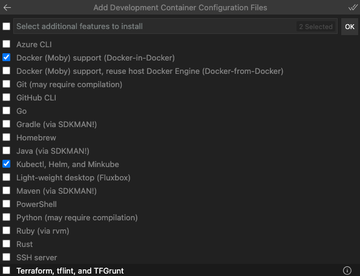

# 📦  Developing inside a Container

_Disclaimer: We are [counting page hits](https://github.wdf.sap.corp/cloud-native-dev/usage-tracker) using a cookie to distinguish returning & new visitors._


## Audience 👩‍💻🧑‍💻

Developers with basic knowledge of Containerization and [Docker](https://www.docker.com/){target=_blank}.

## Learning Objectives 🎯

In this tutorial you will learn

- how to use a [Docker container](https://www.docker.com/){target=_blank} as a full-featured development environment.

This is especially useful if you

- want to ensure that all developers have the same environment (No more: _"But it runs on my machine!"_)

- need to work on different projects which require different versions of Node.js, Python, Java, etc.

## ☝️ Prerequisites

For this tutorial you will require

- [Git client](https://git-scm.com/book/en/v2/Getting-Started-Installing-Git){target=_blank}

- [Docker Desktop](https://www.docker.com/products/docker-desktop){target=_blank}

- [Visual Studio Code](https://code.visualstudio.com/){target=_blank} with the [Visual Studio Code Remote - Containers](https://marketplace.visualstudio.com/items?itemName=ms-vscode-remote.remote-containers){target=_blank} extension

to be installed on your machine.

## 🛫 Getting Started





--8<--- "snippets/npm-install-dependencies.md"

## 📗 Exercises

The [Visual Studio Code Remote - Containers](https://marketplace.visualstudio.com/items?itemName=ms-vscode-remote.remote-containers){target=_blank} extension lets you use a Docker container as a full-featured development environment.

It allows you to open any folder inside (or mounted into) a container and take advantage of Visual Studio Code's full feature set.

A [devcontainer.json](https://code.visualstudio.com/docs/remote/containers#_create-a-devcontainerjson-file){target=_blank} file in your project tells VS Code how to access (or create) a development container with a well-defined tool and runtime stack.

This container can be used to run an application or to separate tools, libraries, or runtimes needed for working with a codebase.

### 1 Add Development Container Configuration Files

First we need to add the required configuration files for our development container.

In VS Code:

1. Open the **`Command Palette`** (e.g. by pressing `F1`)

1. Select:

    **`Remote Containers: Add Development Container Configuration Files`**

1. Select container configuration definition:

    **`Node.js - Develop Node.js based applications`**

    !!! tip "Container Configurations"

        We could also select other preconfigured containers configurations here.

        If we would require a database for our development environment, we could select the `Node.js & PostgresSQL` configuration.

1. Select Node.js version:

    **`16-bullseye`**

    !!! tip "Node.js version"

        The version pattern is `<Node.js Version>-<Debian Release>` as the Docker container is based on Debian/Linux.

1. Select additional features to install:

    No additional features are required for now, simply press `OK`

    !!! tip "Additonal Features"

        We could also select additional features here, such as `Docker-in-Docker` support or `kubectl`.

        This would provide us a development environment for a Kubernetes cluster.

A new folder `.devcontainer` with files `devcontainer.json` and `Dockerfile` should be created in your project folder.


### 2 Adjust the Dockerfile

The `Dockerfile` file in the newly created `.devcontainer` folder can be adjusted to your needs, e.g. to install additional packages.

1. Open the `Dockerfile` file in the newly created `.devcontainer` folder.

1. Uncomment the line `# RUN su node -c "npm install -g <your-package-list-here>"`

1. Replace `<your-package-list-here>` with `npm@latest` to install the latest version of `npm` globally when building the container.

### 3 Adjust the devcontainer.json

The `devcontainer.json` file in the newly created `.devcontainer` folder can be adjusted to your needs, e.g. to

- install extensions into the container,

- forward ports from the host machine to the container,

- configure environment variables for the container,

to just name a few examples.

!!! tip "devcontainer.json reference"

    For further details please refer to the [devcontainer.json reference](https://code.visualstudio.com/docs/remote/containers#_create-a-devcontainerjson-file){target=_blank}.

1. Open the `devcontainer.json` file in the newly created `.devcontainer` folder.

1. Add another entry `"editorconfig.editorconfig"` to the extensions array to add the [EditorConfig](https://marketplace.visualstudio.com/items?itemName=EditorConfig.EditorConfig){target=_blank} extension to the container.

    !!! tip "Adding extensions"

        Adding an extension to a container ensures that this extension is available in VS Code when the container is started.

        This is especially useful if you want to make sure that all developers in your team have the same extensions installed.

        You can also add an extension to a container by right-clicking it in the extension list and selecting `Add to devcontainer.json`.

    

1. Uncomment the line `// "forwardPorts": [],` and add port `3000` to the array to forward our application's port (see `index.js`).

1. Uncomment the line `// "postCreateCommand": "yarn install",` and replace `yarn install` with `npm install` to install the required packages after the container is created.

### 4 Build and Reopen in Container

Now we are ready to open the project folder in a development container.

1. Open the **`Command Palette`** (e.g. by pressing `F1`)

1. Select:

    **`Remote Containers: Rebuild and Reopen in Container`**

    !!! tip "Rebuild and Reopen in Container"

        You need to run this comamand initially or whenever you change the `Dockerfile` or `devcontainer.json` files.

1. Wait for the development container to be created.

    Your project folder should be opened in a development container with the defined packages, extension installed and port forwared.

1. Open the integrated terminal in VS Code and run the following commands.

    - **`uname -a`**

        Should print something like: `Linux e24e6ea8a46e 5.10.76-linuxkit #1 SMP Mon Nov 8 10:21:19 UTC 2021 x86_64 GNU/Linux`

        as the container is based on Debian/Linux.

    - **`hostname`**

        Should print something like: `e24e6ea8a46e`

        as this is the hostname inside the container.

    - **`node -v`**

        Should print something like: `v16.13.2`

        as this is the version of Node.js we have selected when creating the container.

    - **`npm -v`**

        Should print something like: `8.3.2`

        as we have installed the latest npm version globally when building the container.

1. Compare the command outputs to the output when running the commands in your operating system's native terminal.

    If you are on Windows some commands will not work at all as they are only available on Linux-based systems.

1. Check the `Extensions` tab in VS Code to see which extensions are installed locally and in the container.

1. Start the application by running `npm start` in the integrated terminal in VS Code.

1. Open [localhost:3000/hello](http://localhost:3000/hello){target=_blank} in your browser.

    You should get a `Hello World!` response as the port `3000` is forwarded from container to host.

!!! tip "Commit the `.devcontainer` folder "

    You could commit the changes to the `.devcontainer` folder and push them to a remote repository.

    All your developers could use the same development environment (Node.js version, extensions, etc.) by cloning the repository and opening the project folder in a development container.

!!! tip "Reopen Folder Locally"

    You can always select `Remote Containers: Reopen Folder Locally` to exit the development container and to work locally again.

    The container itself can be deleted from your [Docker Desktop - Dashboard](https://docs.docker.com/desktop/dashboard/){target=_blank}.

## 🏁 Summary

Congratulations you have successfully created a development container for your project!

## 📚 Recommended Readings

- [Developing inside a Container](https://code.visualstudio.com/docs/remote/containers){target=_blank}

- [Remote development in Containers](https://code.visualstudio.com/docs/remote/containers-tutorial){target=_blank}

- [Advanced container configuration](https://code.visualstudio.com/remote/advancedcontainers/overview){target=_blank}

## 📓 Additional Examples

### Installing the Cloud Foundry CLI in a Container

In your `.devcontainer/Dockerfile` add the following lines

```Dockerfile
# Add the Cloud Foundry Foundation public key and package repository
RUN wget -q -O - https://packages.cloudfoundry.org/debian/cli.cloudfoundry.org.key | sudo apt-key add -
RUN echo "deb https://packages.cloudfoundry.org/debian stable main" | sudo tee /etc/apt/sources.list.d/cloudfoundry-cli.list

# Install the Cloud Foundry CLI
RUN apt-get update && export DEBIAN_FRONTEND=noninteractive \
  && apt-get -y install --no-install-recommends cf8-cli
```

E.g. as seen [here](https://github.tools.sap/D068098/exercise-code-nodejs/blob/bulletinboard-ads-solution/.devcontainer/Dockerfile){target=_blank}.

After **rebuildung** your container, e.g. running `Remote Containers: Rebuild and Reopen in Container` or `Remote Containers: Rebuild Container`, you can use the `cf` command to interact with your Cloud Foundry account in your container.

### Connect to a Kuberness Cluster from a Container

When [adding the development container configuration files](#1-add-development-container-configuration-files) select additional features:

- **`Docker (Moby) support (Docker-in-Docker)`**

- **`Kubectl, Helm, and Minikube`**



Then in your `.devcontainer/devcontainer.json` you can set the `KUBECONFIG` environment variable pointing to your `kubeconfig.yml`  under `containerEnv`:

```json
"containerEnv": {
  "KUBECONFIG": "${containerWorkspaceFolder}/.k8s/kubeconfig.yml"
}
```

E.g. as seen [here](https://github.tools.sap/D068098/exercise-code-nodejs/blob/bulletinboard-ads-solution/.devcontainer/devcontainer.json){target=_blank}.

After **rebuildung** your container, e.g. running `Remote Containers: Rebuild and Reopen in Container` or `Remote Containers: Rebuild Container`, you can use

- the `kubectl` command to interact with your Kubernetes Cluster in your container

- the `docker` command **inside the container** (`Docker-in-Docker`) to build and push your images

### Enabling CAP CDS Development in a Container

If you want to enable CAP CDS Development in a container, you can follow [this blog post](https://blogs.sap.com/2020/10/26/create-a-development-container-for-cds-in-visual-studio-code/){target=_blank}, but updating to the latest Node.js, CAP, etc. versions.
