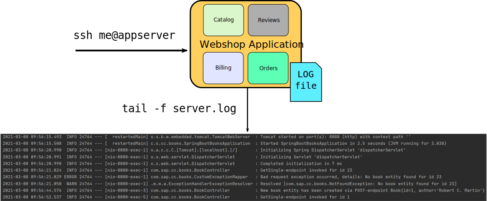
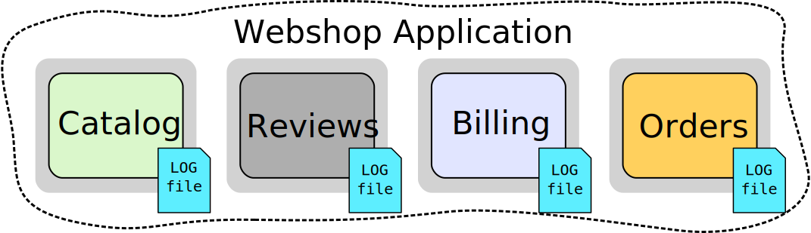
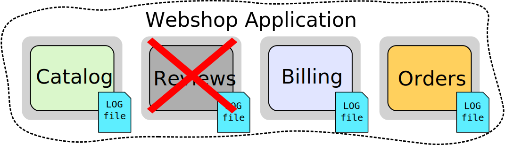
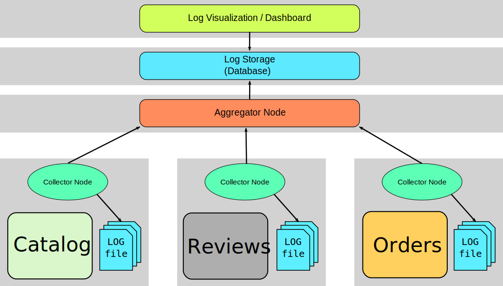
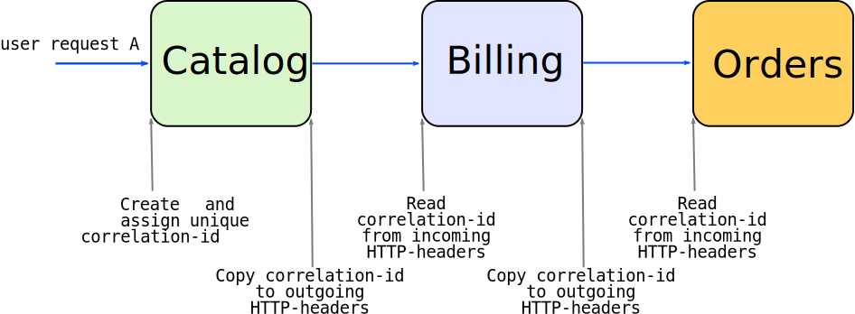

# Distributed Logging

---

### Logging in the good old days

 <!-- .element style="max-height: 30rem;" -->

Notes:
- single machine where the app runs on
- logs are gathered in one single place
- log representation is embedded in the log itself, human readable format
  - truncation and compression in order to make the logs look good in a terminal
  - data like full package names are lost
- logs are accessed through e.g. ssh
- limited searching and filtering capacities
- this is not considered bad as the logs fulfill their purpose

---

### Moving towards Distributed Systems

- What challenges arise in terms of Logging?

Notes:
- To the audience: 
  - Can you imagine what challenges arise regarding logging in distributed systems?

---

### Tackled Challenges

- Scattered logs
- Missing correlation of logs
- Inconsistent structure of logs

---

### Scattered Logs

  
  

- every instance is logging on their own
  - accessibility not ideal
  - what happens when a container goes down
- Remedy: **Log Consolidation**

Notes:
- not comfortable to access every instances logs separately
- logs can get lost due to crashes or during scaling processes
- log consolidation
  - gather together all the logs at a single place (e.g. log server)
  - send the logs to the server as soon as they arise

---

### Missing Correlation of Logs

- requests traverse multiple services
- missing context of logs
- how to trace a transaction across multiple services
- Remedy: **Correlation ID**

Notes:
- a request to a particular domain can involve a myriad of subsequent requests from the starting service to others
- microservice only knows about the information passed in the message it processes
  - microservice does not "see the Big Picture"
- logs are spread in the different log files
    - how do we keep track of the whole request-flow and the respective logs?
- use a unique identifier, i.e. correlation id, to identify the "overall request" that is processed in multiple services

---

### Inconsistent Structure of Logs

- logs from different sources can come in a variety of formats
- processing raw logs can be a data analytics nightmare
- structure of logs should ease the process of troubleshooting and tracing
- Remedy: **Log Standardization**

Notes:
- [5 Essential Tips for Logging Microservices](https://searchapparchitecture.techtarget.com/tip/5-essential-tips-for-logging-microservices)
  - see tip no. 2

- Log Standardization: consistent and predetermined message format that makes it easy for automated systems to parse the logs

---

### Finding a Solution Concept

In a containerized microservices world, we must think differently about logging

Notes:
- the strategies and methods of "traditional" logging are not sufficient in the context of distributed systems
- (it seems) there is no way around creating an infrastructure to handle distributed logging
- many open-source and third-party-tools and cloud services are available to manage distributed logging

---

### Distributed Logging Infrastructure

  

Notes:
- Example setup for a distributed logging infrastructure
  - this gives an overview of common components in such an infrastructure (every setup might look slightly different depending on specific project requirements)
  - designing and setting up this infrastructure is not in the scope of this learning module
  - the focus is on: what has to be done on the application side to make distributed logging work and how to analyze and trace the logs with a common visualization tool 
- Collector Node (Agent):
  - pick up logging data and forward to aggregator
  - lives next to the application containers
  - may process raw logs into structured data, i.e. JSON or some other standard format
  - forwards the structured data in real-time or micro-batches to the aggregator
- Aggregator Node:
  - combine multiple smaller streams into a single data stream that’s easier to process and ingest into the Store, where it’s persisted for future consumption
- Central Log Storage
  - collects all the logs from different microservices into a single storage that can outlive the microservices
  - provides fast access to recent logs (e.g. 5-7 days)
  - archives older logs
- Log Visualization
  - one single user-interface that lets you
    - query and visualize the logs
    - search and filter the logs

---

### Log Standardization

- use a structured log format (e.g. JSON)
  - ingest and analyze easier
  - avoid costly parsing of raw text logs
- standardize keys and values across microservices
  - key names (`msg` vs. `message`)
  - value formats, acronyms (time format, `WARN` vs. `WARNING`)

Notes:
- pick a structured log format like JSON and use it for all microservice
- standardize keys and values within log events to make it easier to find what you are looking for

---

### Correlation ID

- unique identifier, attached to requests and messages
- allow reference to a particular transaction
- usually defined as a non-standard HTTP header, e.g.:
  - `X-Request-ID`
  - `X-Correlation-ID`
  - `X-CorrelationID`

---

### Propagating Context Information

Notes:
- new request: create and assign new unique correlation-id
- copy the correlation-id to the outgoing http-requests header
- read the correlation-id from incoming requests

---

### Further Reading
- [Architecture of Distributed Logging](https://blog.treasuredata.com/blog/2016/08/03/distributed-logging-architecture-in-the-container-era/)
- [Understanding Correlation IDs](https://www.rapid7.com/blog/post/2016/12/23/the-value-of-correlation-ids/)
- [What is ELK?](https://medium.com/socialbakers-engineering/collecting-logs-from-whole-infrastructure-using-elk-stack-f8b8af42b665)

---

### Quiz

Notes:
- some questions coming up
- for each question there are answer-options (A, B, C, D)
- facilitator: write options into chat and let the participants vote by reacting to the options
- multiple answers can be correct

---

### Question #1

Scattered logs is the challenge of...
- A: missing standardization of logs
- B: the logs being distributed on different instances
- C: some logs being lost
- D: too many cluttered logs

------

### Question #1

Scattered logs is the challenge of...
- A: missing standardization of logs
- **B: the logs being distributed on different instances**
- C: some logs being lost
- D: too many cluttered logs

---

### Question #2

What should you do to standardize your logs?
- A: collect all the logs from different microservices into a single storage
- B: use a structured log format (e.g. JSON)
- C: standardize keys and values across microservices
- D: use correlation IDs

------

### Question #2

What should you do to standardize your logs?
- A: collect all the logs from different microservices into a single storage
- **B: use a structured log format (e.g. JSON)**
- **C: standardize keys and values across microservices**
- D: use correlation IDs

Notes:

- **A** helps with log consolidation
- **D** helps against missing correlation of logs

---

# Questions?
