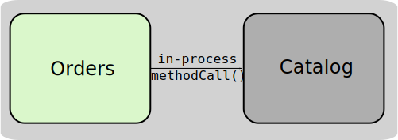
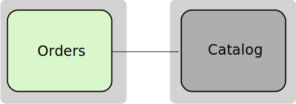
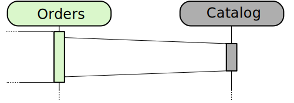
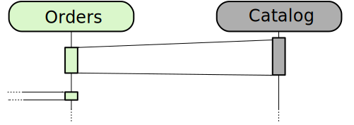
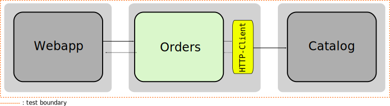
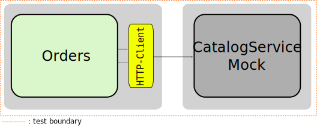
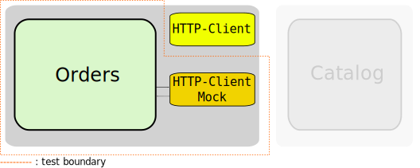

# Service to Service Communication

---

## Microservices don't exist in isolation

  
  

Notes:

- In a monolith, the different components are running in the same process and communication between them is via method invocation (in-process calls).
- Microservices run in separate processes and thus need a way to communicate with each other across process boundaries

---

## Options for Communication

  
  

Notes:

- There are many options to choose e.g.: gRPC, SOAP or MQ
- Depending on your requirements you might want to evaluate if you want to use async or sync communication
- Synchronous (1st image): Orders can only respond to its caller once the response from the Catalog service is received
- Asynchronous (2nd image): Catalog constantly notifies Orders whenever it has relevant changes, so that Orders has all necessary information when a request is received
- In the exercise we're going to use REST-APIs to implement synchronous communication

---

### Test Approaches

- Group Exercise: What options are available to test the communication?

Notes:
- testing strategies that were applied on monolithic apps may need to be reconsidered in microservice architectures
- we're going to discuss a few approaches for managing the tests

For trainers:
- Take participants to a MURAL board created from [this template](https://app.mural.co/template/f24786df-f038-4893-88b0-e30914ebeb7b/2c287ae6-9471-4d94-820a-9f303076381f)
- Divide them into three groups and assign a test approach to each one
- Give them five minutes to prepare a small presentation
- Let each group present their topic
- Eventually use the following slides to present aspects that were missing in the participant's presentation

---

## Test Approach: End-to-End

<!-- .element height="350rem" -->

- Inter-service communication is fully covered
- Can be difficult to write and maintain

Notes:

- End-to-end tests give us high confidence, because they ensure that microservices are well integrated.
- Their test boundary is much larger than for other types of test -> Complex setup
- This can lead to:
  - Flakiness
  - Excessive test runtime
  - Additional cost of maintenance of the test suite

---

## Test Approach: Out-of-Process

<!-- .element height="350rem" -->

- Stub the external service
- Test boundary encompasses the full microservice

Notes:

- Out of process component tests give us less confidence but still the entire microservice can be covered
- Test harness is responsible for starting and stopping external stubs and coordinating network ports and configuration

---

## Test Approach: In-Process

<!-- .element height="350rem" -->

- Tests do not touch the network whatsoever

Notes:

- The HTTP-Client is mocked
- The artifact being tested has to be altered for testing purposes
- Minimizes the number of moving parts reducing build complexity
- Faster test execution time

---

# Questions?
