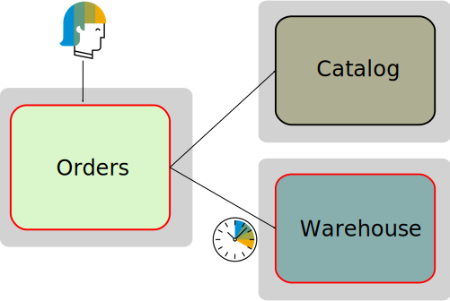
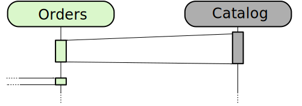
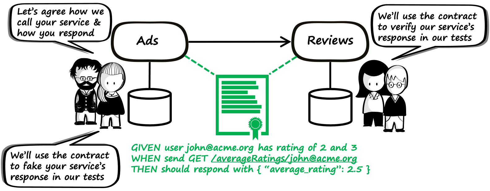

# Service to Service - Reflection Points

---

## Service Dependencies

- Availability is multiplied: 99% × 99% = 98.01%
- Who is responsible for the **Orders**-service not responding?

Notes:

- The call to warehouse times out, causing the orders app to crash or, even worse: wait forever for a response.
- Say service A and B have a SLA uptime of 99%. That means that there's a guarantee that 99% of the time these services will be there to successfully serve requests.
- When both services are needed to make an operation successful, we need to multiply the probability of each service being available: 0.99 * 0.99 = 0.9801
- Therefore: With each additional service involved in processing an operation the availability decreases

---

## Service Dependencies

- What if a called service doesn't answer (in time)?
- How to avoid cascading failures / latency?
- How to avoid flooding a server with requests while it's restarting after a crash?

Notes:

- Flooding: Say a server was temporarily unavailable or had crashed for whatever reason.
  Immediately hitting it with all the requests which have piled up during the downtime will likely crash it again

---

## Resilience

- The ability of a system to handle unexpected situations
    - without the user noticing it (best case)
    - with a graceful degradation of service (worst case)

- Fallback approach for graceful degradation:
    - use cached (potentially outdated) value
    - use sensible default
    - try second-best alternative (e.g. apply to message queue)

- [Cloud Native Bootcamp challenge](https://pages.github.tools.sap/cloud-native-bootcamp/info/challenges/resilience.html)

Notes:

- Fault-tolerance
- We will not fully explore this topic in this training, but you can do so in a follow-up [Cloud Native Bootcamp training](https://github.tools.sap/cloud-native-bootcamp/info#cloud-native-bootcamp)

---

## Resilience Patterns

- Fail fast / silent
- Retry
- Circuit breaker pattern
- Load shedding
- Request caching

Notes:

- Load shedding: requests are rejected under certain conditions

---

## Decouple Services

- Decouple services using eventual consistency and asynchronous communication
- [Cloud Native Bootcamp challenge](https://pages.github.tools.sap/cloud-native-bootcamp/info/challenges/decouple-services.html)

Notes:

- When information needs to be queried, resilience patterns may not be enough
- Instead of calling the Catalog service whenever information is required, the Catalog service notifies the Orders service whenever the relevant data is updated.
- The Orders service saves that data and can serve it anytime.
- Although the data provided by the Orders service may be out of date for short periods of time, it will be consistent, eventually.

---

## Testing

How can we ensure that an application is working when it's spanning multiple microservices which are developed by separate teams and deployed independently?

- End-to-end tests?
- What issues do you run into, when testing end-to-end extensively?

Notes:

- End-to-end testing is the only approach (out of the previously covered) which ensures that both services can actually work together
- Tests which touch on multiple microservices are complex and have a lot of downsides (see next slide)

---

## Issues with Multi-Service Tests

- Slowness
- Hard to maintain/orchestrate
- Unreliable, flaky or brittle
- Hard to fix
- Scale badly
- Bugs are found too late in the process

Notes:

- slow: they traverse multiple systems with each jump introducing additional latency
- hard to maintain: require all systems to be in the correct state before they are run, including correct version and data
    - Which also begs the question: Which is the *right* version?
- flaky/brittle: due to the complexity of a test environment for a distributed system, there are many bad reasons a test can fail such as configuration or network issues (timeouts)
- hard to fix: thanks to the distributed and remote nature of the problem, troubleshooting is usually difficult
- scale badly: as more teams' code gets tested, things get more entangled, test suites run exponentially slower and releases get clogged in automation pipelines
- late bugs: in many situations these tests are only run in CI, after the code has been committed; delay in feedback is costly

---

## Contract Testing

- [Cloud Native Bootcamp Challenge](https://pages.github.tools.sap/cloud-native-bootcamp/info/challenges/contract-testing.html)

Notes:

- Contract testing can avoid these pains, but it's beyond the scope of this training
- The "consumer" writes tests for the "provider" service, thereby defining the contract
- The "provider" adheres to the contract by ensuring that each release passes the tests written by the consumer
    - e.g. by running them in their CI pipeline
- Further Reading: [What is contract testing and why should I try it?](https://pactflow.io/blog/what-is-contract-testing/)

---

# Questions?
